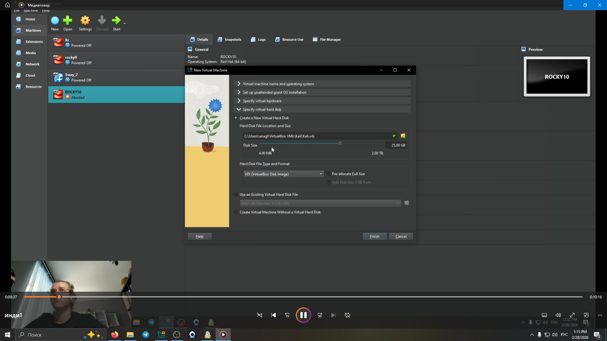
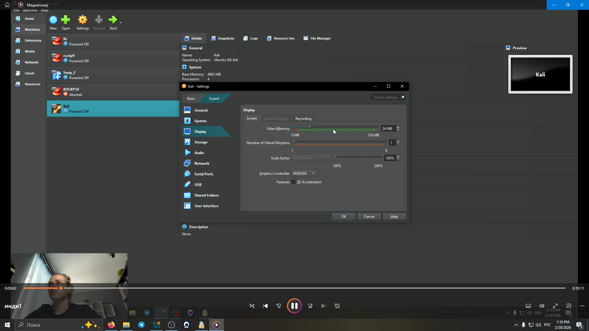
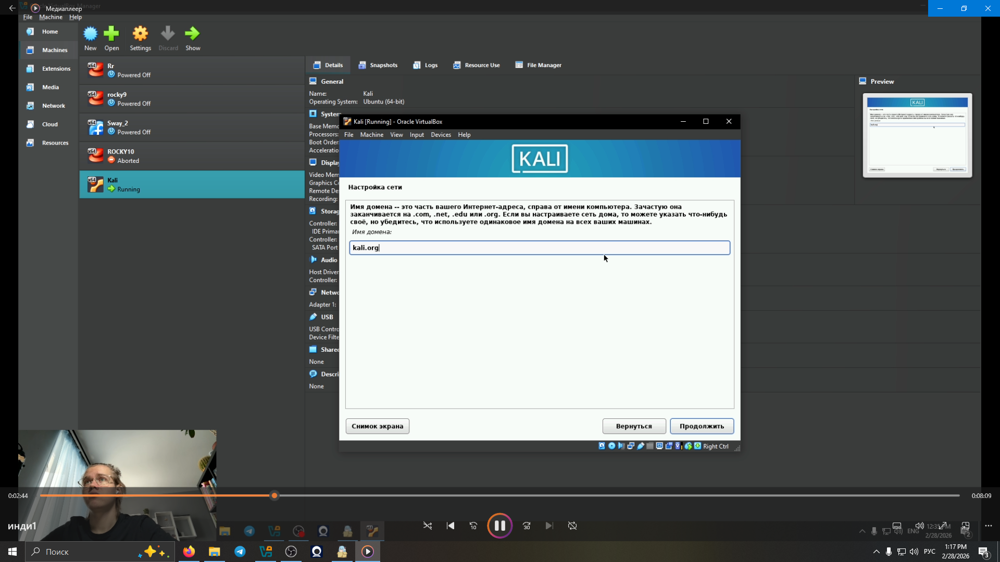
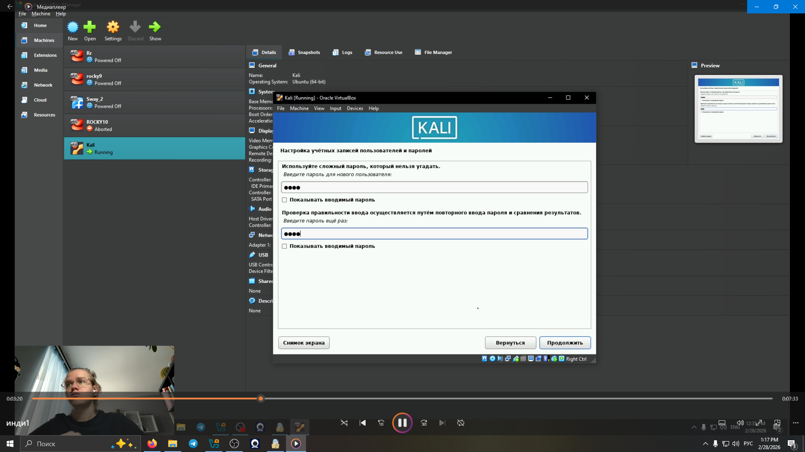
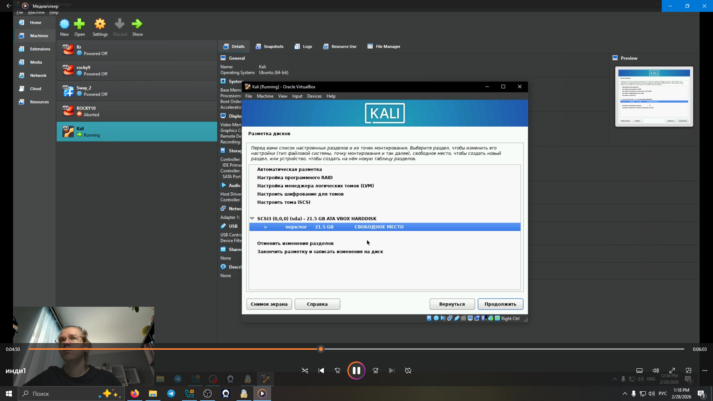
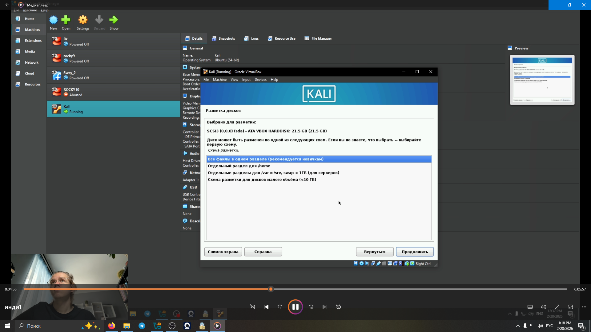
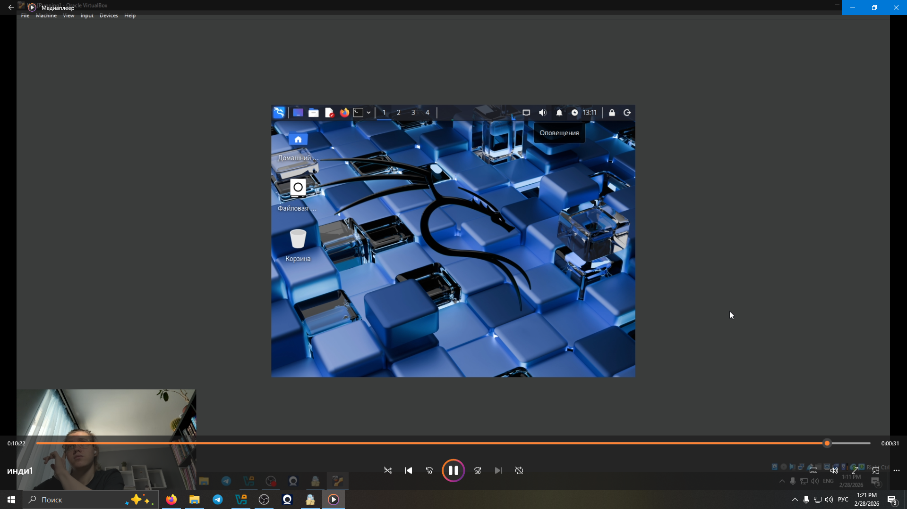

---
## Front matter
lang: ru-RU
title: Этап 1
subtitle: Установка Kali Linu
author:
  - Глобин Никита Анатольевич
institute:
  - Российский университет дружбы народов, Москва, Россия

date: 28 02 2026

## i18n babel
babel-lang: russian
babel-otherlangs: english

## Formatting pdf
toc: false
toc-title: Содержание
slide_level: 2
aspectratio: 169
section-titles: true
theme: metropolis
header-includes:
 - \metroset{progressbar=frametitle,sectionpage=progressbar,numbering=fraction}
---


# Создание презентации

## Процессор `pandoc`

- Pandoc: преобразователь текстовых файлов
- Сайт: <https://pandoc.org/>
- Репозиторий: <https://github.com/jgm/pandoc>

## Формат `pdf`

- Использование LaTeX
- Пакет для презентации: [beamer](https://ctan.org/pkg/beamer)
- Тема оформления: `metropolis`

## Код для формата `pdf`

```yaml
slide_level: 2
aspectratio: 169
section-titles: true
theme: metropolis
```

## Формат `html`

- Используется фреймворк [reveal.js](https://revealjs.com/)
- Используется [тема](https://revealjs.com/themes/) `beige`

## Код для формата `html`

- Тема задаётся в файле `Makefile`

```make
REVEALJS_THEME = beige 
```


# Элементы презентации

## Актуальность

Установка Kali Linux

## Цели и задачи

- Установка Kali Linux


## Содержание исследования

Подключаем образ.

{ width=70%}


## Содержание исследования


Первоначальная настройка .

{ width=70%}

## Содержание исследования


{ width=70%}

## Содержание исследования


Устоновака 

{ width=70%}

## Содержание исследования


выбор языка 

{ width=70%}


## Содержание исследования


настойка пользователя 

{ width=70%}

## Содержание исследования


{ width=70%}

## Содержание исследования


{ width=70%}

## Содержание исследования


{ width=70%}


## Содержание исследования


настройка хранилища 

{ width=70%}

## Содержание исследования


{ width=70%}

## Содержание исследования


{ width=70%}

## Содержание исследования


{ width=70%}

## Содержание исследования


{ width=70%}

## Содержание исследования


{ width=70%}


## Содержание исследования


настройка системы 

{ width=70%}

## Содержание исследования


{ width=70%}

## Содержание исследования


{ width=70%}


## Результаты


По ходу работы мы устоновили Kali Linux


