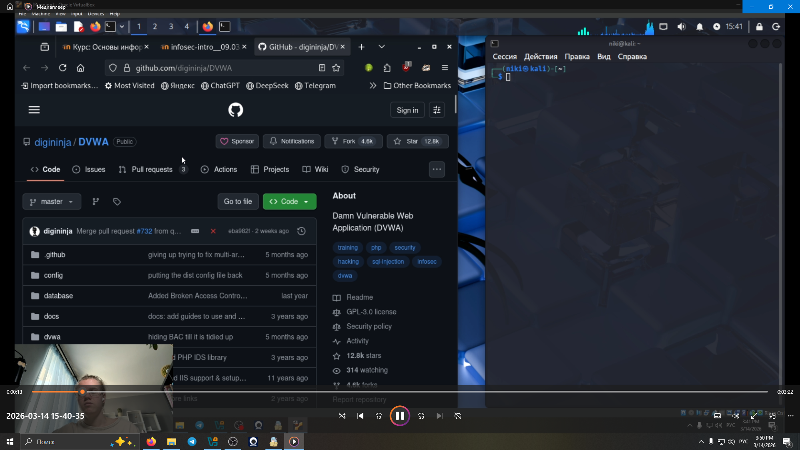
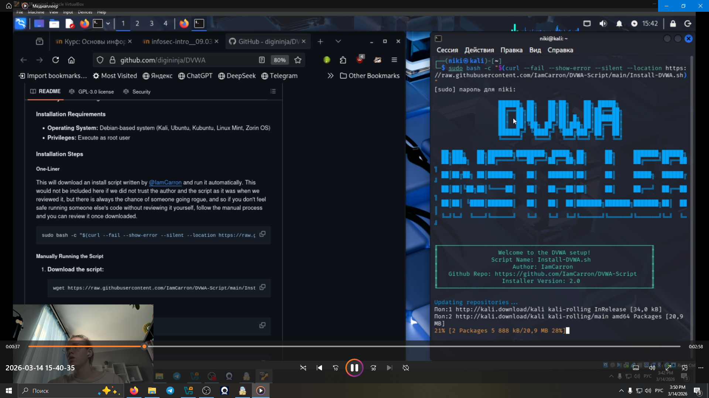
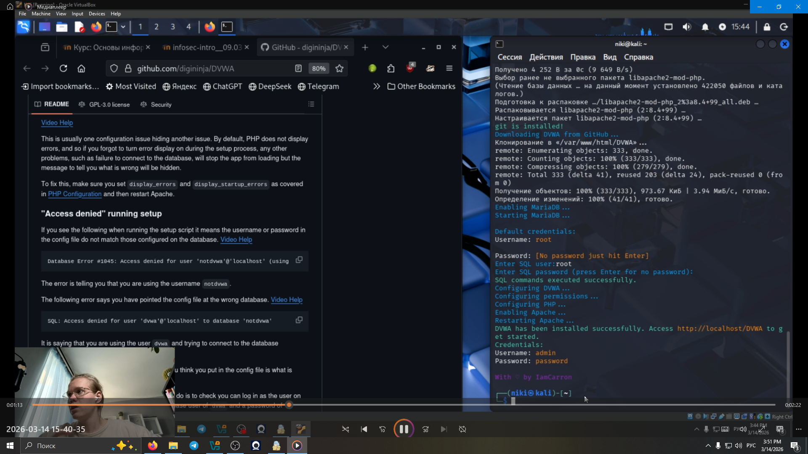
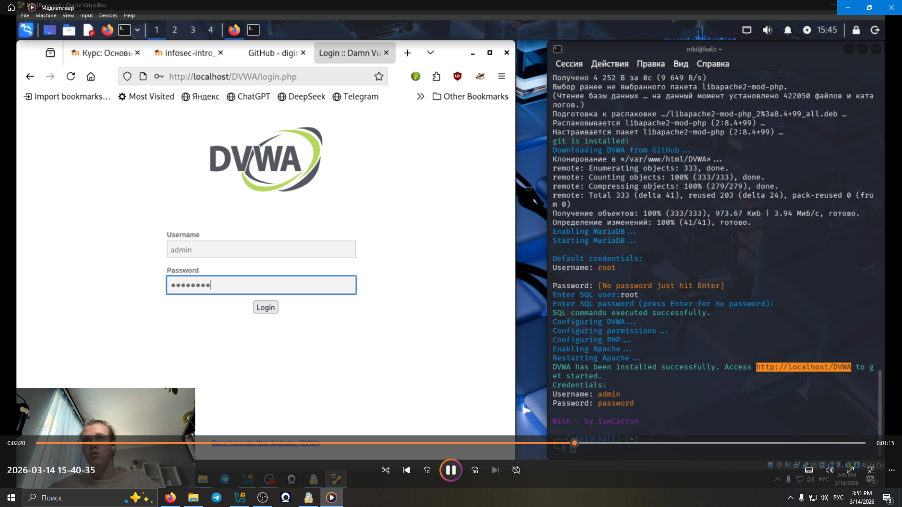
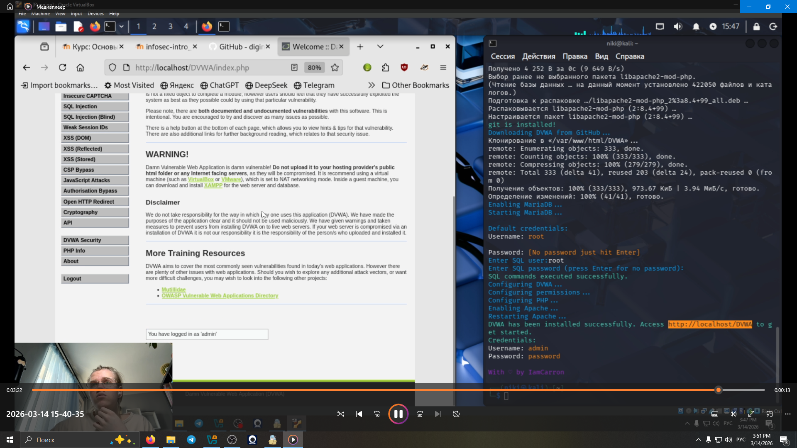

---
## Front matter
lang: ru-RU
title: Этапы реализации проекта
subtitle: Этап 2. Установка DVWA
author:
  - Глобин Никита Анатольевич
institute:
  - Российский университет дружбы народов, Москва, Россия

date: 14 03 2026

## i18n babel
babel-lang: russian
babel-otherlangs: english

## Formatting pdf
toc: false
toc-title: Содержание
slide_level: 2
aspectratio: 169
section-titles: true
theme: metropolis
header-includes:
 - \metroset{progressbar=frametitle,sectionpage=progressbar,numbering=fraction}
---

# Информация

## Докладчик

:::::::::::::: {.columns align=center}
::: {.column width="70%"}

  * Кулябов Дмитрий Сергеевич
  * д.ф.-м.н., профессор
  * профессор кафедры прикладной информатики и теории вероятностей
  * Российский университет дружбы народов
  * [kulyabov-ds@rudn.ru](mailto:kulyabov-ds@rudn.ru)
  * <https://yamadharma.github.io/ru/>

:::
::: {.column width="30%"}


:::
::::::::::::::


# Создание презентации

## Процессор `pandoc`

- Pandoc: преобразователь текстовых файлов
- Сайт: <https://pandoc.org/>
- Репозиторий: <https://github.com/jgm/pandoc>

## Формат `pdf`

- Использование LaTeX
- Пакет для презентации: [beamer](https://ctan.org/pkg/beamer)
- Тема оформления: `metropolis`

## Код для формата `pdf`

```yaml
slide_level: 2
aspectratio: 169
section-titles: true
theme: metropolis
```

## Формат `html`

- Используется фреймворк [reveal.js](https://revealjs.com/)
- Используется [тема](https://revealjs.com/themes/) `beige`

## Код для формата `html`

- Тема задаётся в файле `Makefile`

```make
REVEALJS_THEME = beige 
```


# Элементы презентации


## Цели и задачи

- Установка DVWA


## Содержание исследования

переходим на сайт  https://github.com/digininja/DVWA 

{ width=70%}

## Содержание исследования

начинаем устоновку 

{width=70%}


## Содержание исследования


создаём пользователя 

{width=70%}


## Содержание исследования


взходим в акаунт 

{width=70%}


## Содержание исследования


{width=70%}


## Результаты

- Мы устоновили DVWA


