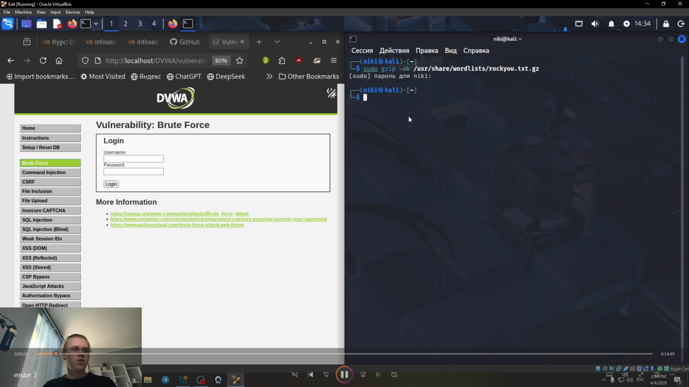

---
## Front matter
lang: ru-RU
title: Этап 3
subtitle: Использование Hydra
author: Глобин Никита Анатольевич
  - 
institute:
  - Российский университет дружбы народов, Москва, Россия

date: 04.04 2026

## i18n babel
babel-lang: russian
babel-otherlangs: english

## Formatting pdf
toc: false
toc-title: Содержание
slide_level: 2
aspectratio: 169
section-titles: true
theme: metropolis
header-includes:
 - \metroset{progressbar=frametitle,sectionpage=progressbar,numbering=fraction}
---

# Элементы презентации

## Актуальность

научится пользоватся Использование Hydra

## Цели и задачи

научится пользоватся Использование Hydra

## Содержание исследования

открываем архив(рис. [-@fig:001]).

{#fig:001 width=70%}

## Содержание исследования

прописываем команду (рис. [-@fig:001]).

{#fig:001 width=70%}

## Содержание исследования

проверяем пароль(рис. [-@fig:001]).

{#fig:001 width=70%}

## Результаты

Мы научились ползоватся брутфорсом в Hydra
