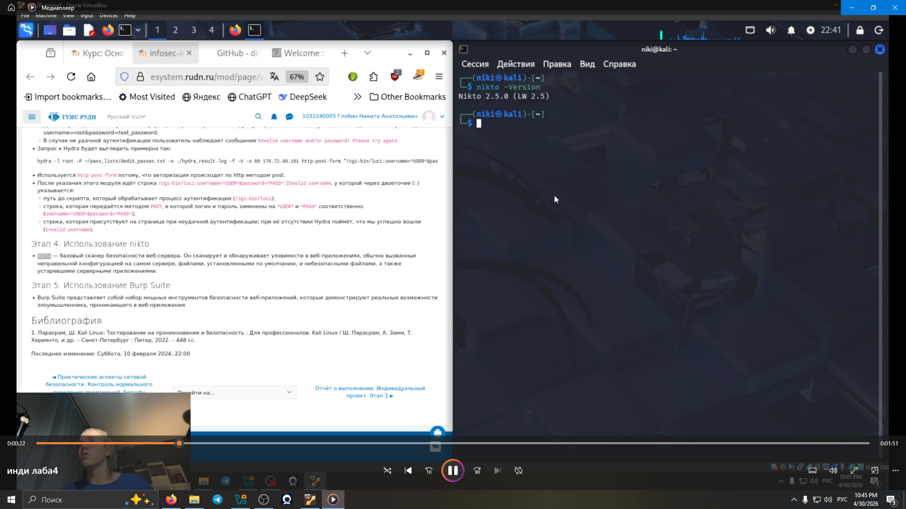
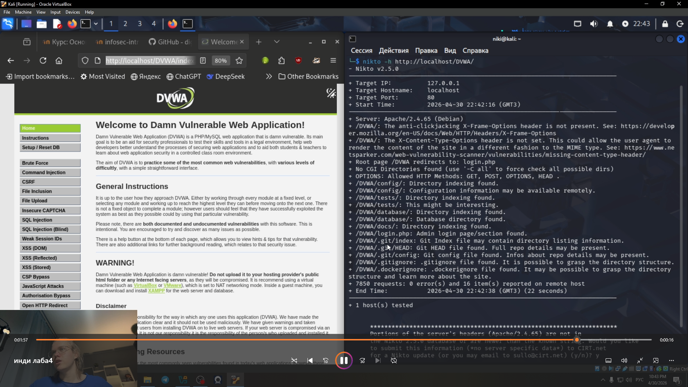

---
## Front matter
lang: ru-RU
title: Этап 4.
subtitle: Использование nikto
author:
  - Глобин Никита Анатольевич
institute:
  - Российский университет дружбы народов, Москва, Россия

date: 30 04 2026

## i18n babel
babel-lang: russian
babel-otherlangs: english

## Formatting pdf
toc: false
toc-title: Содержание
slide_level: 2
aspectratio: 169
section-titles: true
theme: metropolis
header-includes:
 - \metroset{progressbar=frametitle,sectionpage=progressbar,numbering=fraction}
---

# Информация


# Создание презентации

## Процессор `pandoc`

- Pandoc: преобразователь текстовых файлов
- Сайт: <https://pandoc.org/>
- Репозиторий: <https://github.com/jgm/pandoc>

## Формат `pdf`

- Использование LaTeX
- Пакет для презентации: [beamer](https://ctan.org/pkg/beamer)
- Тема оформления: `metropolis`

## Код для формата `pdf`

```yaml
slide_level: 2
aspectratio: 169
section-titles: true
theme: metropolis
```

## Формат `html`

- Используется фреймворк [reveal.js](https://revealjs.com/)
- Используется [тема](https://revealjs.com/themes/) `beige`

## Код для формата `html`

- Тема задаётся в файле `Makefile`

```make
REVEALJS_THEME = beige 
```

# Элементы презентации


## Цели и задачи

Научится пользоватся nikto


## Содержание исследования


Проверяем устоновлен ли nikto (рис. [-@fig:001]).

{#fig:001 width=70%}


## Содержание исследования

запускаем nikto на нашь DVWA (рис. [-@fig:002]).

{#fig:002 width=70%}


## Результаты

- Не нужны все результаты
- Необходимы логические связки между слайдами
- Необходимо показать понимание материала


## Итоговый слайд

мы научились пользоваться nikto

