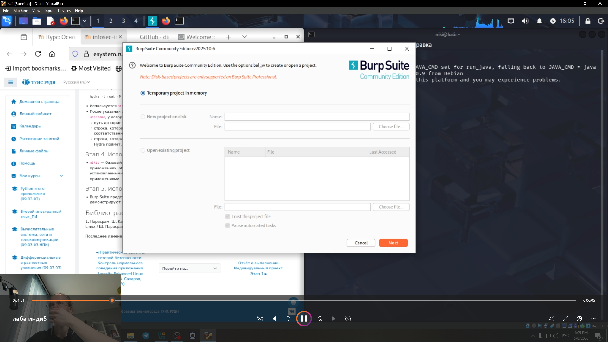
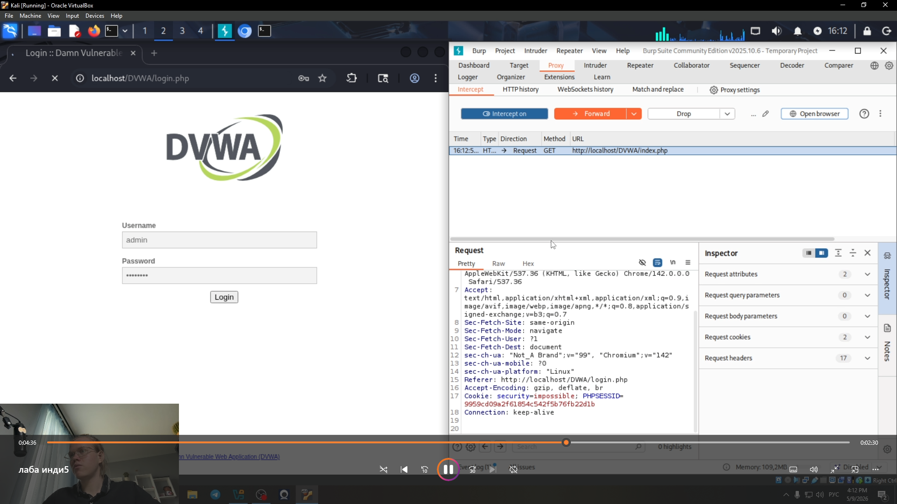
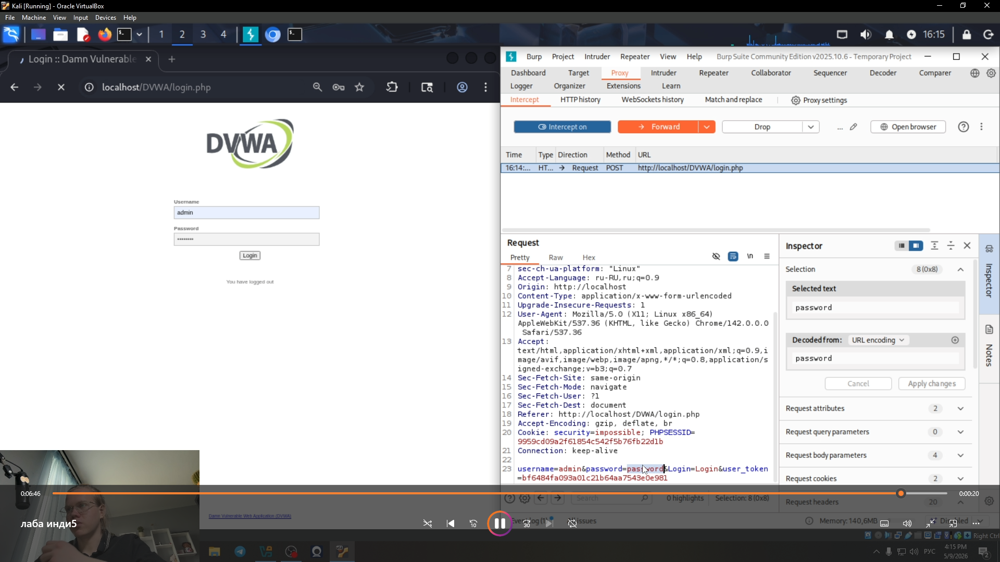

---
## Front matter
lang: ru-RU
title: Этап 5.
subtitle: Использование  Burp Suite
author:
  - Глобин Никита Анатольевич
institute:
  - Российский университет дружбы народов, Москва, Россия

date: 09 05 2026

## i18n babel
babel-lang: russian
babel-otherlangs: english

## Formatting pdf
toc: false
toc-title: Содержание
slide_level: 2
aspectratio: 169
section-titles: true
theme: metropolis
header-includes:
 - \metroset{progressbar=frametitle,sectionpage=progressbar,numbering=fraction}
---

# Элементы презентации

## Цели и задачи

Изучить архитектуру и функциональные возможности Burp Suite как инструмента для анализа безопасности веб-приложений, а также освоить практические методы перехвата, модификации и анализа HTTP-трафика для выявления типовых уязвимостей.

## Содержание исследования

запускаем  Burp Suite(рис. [-@fig:001]).

{#fig:001 width=70%}

## Содержание исследования
 
создаём временный проект в Burp Suite(рис. [-@fig:002]).

{#fig:002 width=70%}

## Содержание исследования
 

отсеживаем как проходит перехваит при регистрации в Burp Suite(рис. [-@fig:003]).

{#fig:003 width=70%}

## Содержание исследования
 

смотреи что мы перехвотили в Burp Suite(рис. [-@fig:004]).

{#fig:004 width=70%}

## Итоговый слайд

мы научились анализировать и работать с Burp Suite

