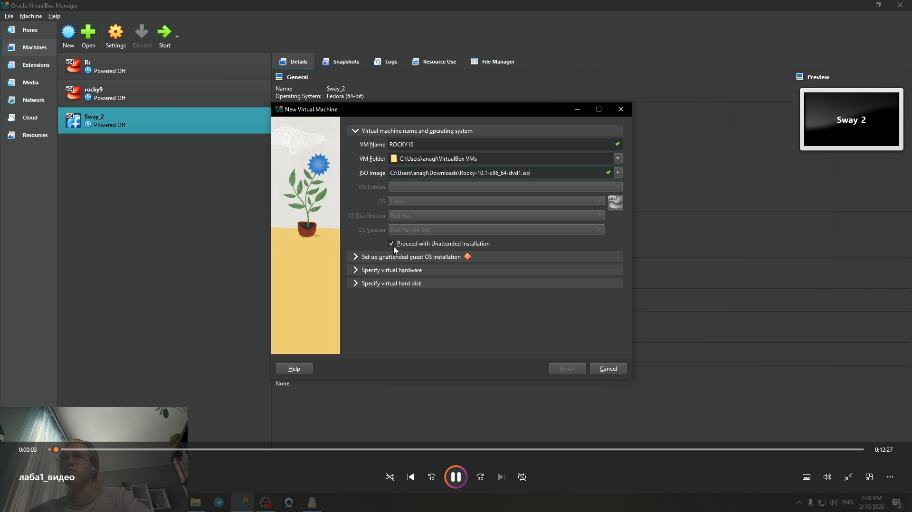
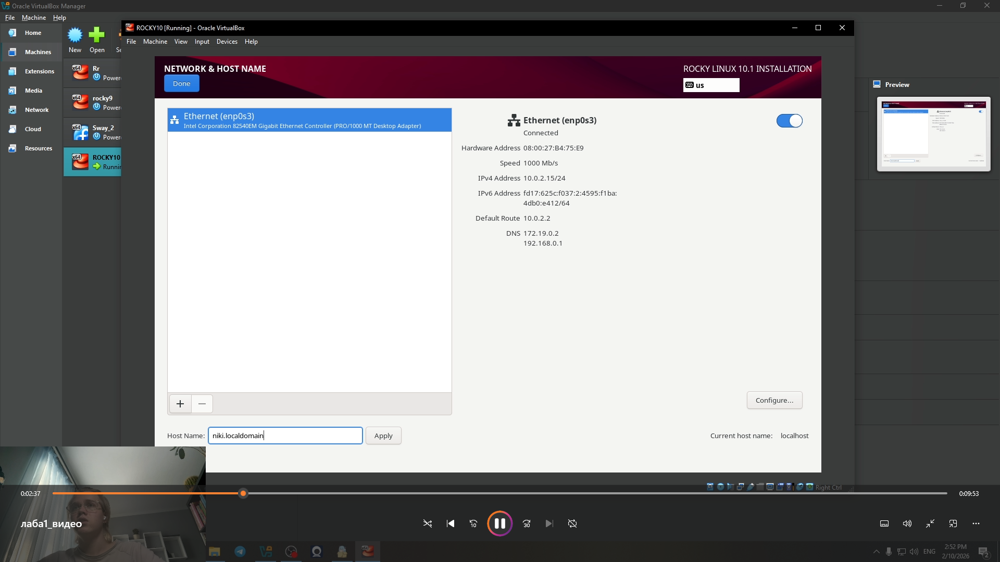
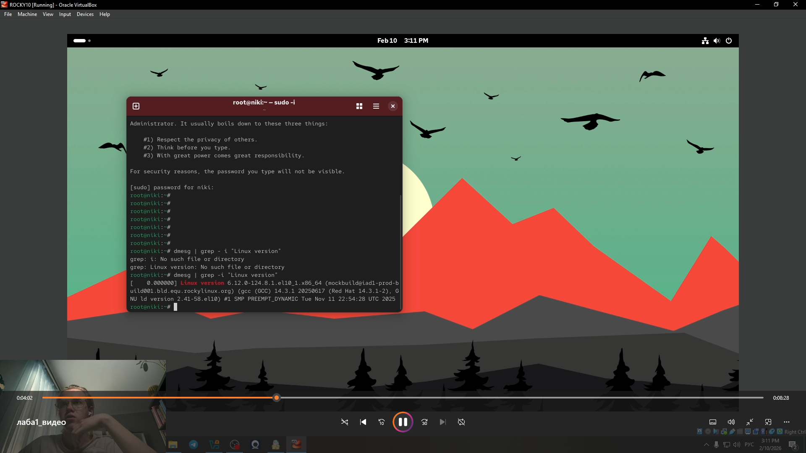

---
## Front matter
lang: ru-RU
title: Лабораторная работа № 1
subtitle: Установка и конфигурация операционной системы на виртуальную машину
author:
  - Глобин Никита Анатольевич
institute:
  - Российский университет дружбы народов, Москва, Россия
 

## i18n babel
babel-lang: russian
babel-otherlangs: english

## Formatting pdf
toc: false
toc-title: Содержание
slide_level: 2
aspectratio: 169
section-titles: true
theme: metropolis
header-includes:
 - \metroset{progressbar=frametitle,sectionpage=progressbar,numbering=fraction}
---

# Информация

## Докладчик

:::::::::::::: {.columns align=center}
::: {.column width="70%"}

  * Глобин Никита Анатольевич

:::

:::
::::::::::::::

# Элементы презентации

## Актуальность

Целью данной работы является приобретение практических навыков
установки операционной системы на виртуальную машину, настройки ми-
нимально необходимых для дальнейшей работы сервисов.

## Цели и задачи

- устоновка виртуальной машины
- настройка
- контрольные вопросы 

## Устоновка системы

1. подключить образ

{width=70%}

## Устоновка системы

2. настроить размер хронилища 

{width=70%}

## Устоновка системы

3. Запусть систему 

{width=70%}

## Устоновка системы

4. работаем с устоновщиком линукс и подключаем хронилище

{width=70%}

## Устоновка системы

5. Настраиваем пользователя root 

{width=70%}

## Устоновка системы

6. Настраиваем нашего пользователя 

{width=70%}

## Устоновка системы

7. Настраиваем сеть 

{width=70%}

## Домашнее задание

1. Версия ядра Linux (Linux version).

{width=70%}

## Домашнее задание

2. Частота процессора (Detected Mhz processor).

{width=70%}

## Домашнее задание

3. Модель процессора (CPU0).

{width=70%}

## Домашнее задание

4. Объем доступной оперативной памяти (Memory available).

{width=70%}

## Домашнее задание

5. Тип обнаруженного гипервизора (Hypervisor detected).

{width=70%}

## Домашнее задание

6. Тип файловой системы корневого раздела

{width=70%}

## Домашнее задание

7. Последовательность монтирования файловых систем.

{width=70%}

## Контрольные вопросы

1. Учетная запись пользователя содержит информацию о его имени, идентификаторе (UID), группах, правам доступа и других параметрах.

2. Команды:

* для получения справки по команде: man <команда> или <команда> --help
* для перемещения по файловой системе: cd <путь>
* для просмотра содержимого каталога: ls
* для определения объёма каталога: du -sh <каталог>
* для создания каталога: mkdir <каталог>; для удаления каталога: rmdir <каталог> или rm -r <каталог>
* для создания файла: touch <файл>; для удаления файла: rm <файл>
* для задания прав на файл/каталог: chmod <права> <файл/каталог>
* для просмотра истории команд: history

## Контрольные вопросы

3. Файловая система — это способ организации и хранения файлов на устройстве хранения данных. Примеры: ext4 

4. Для просмотра, какие файловые системы подмонтированы в ОС, используется команда: df -T

5. Для удаления зависшего процесса используется команда: kill или kill -9 

## Результаты

