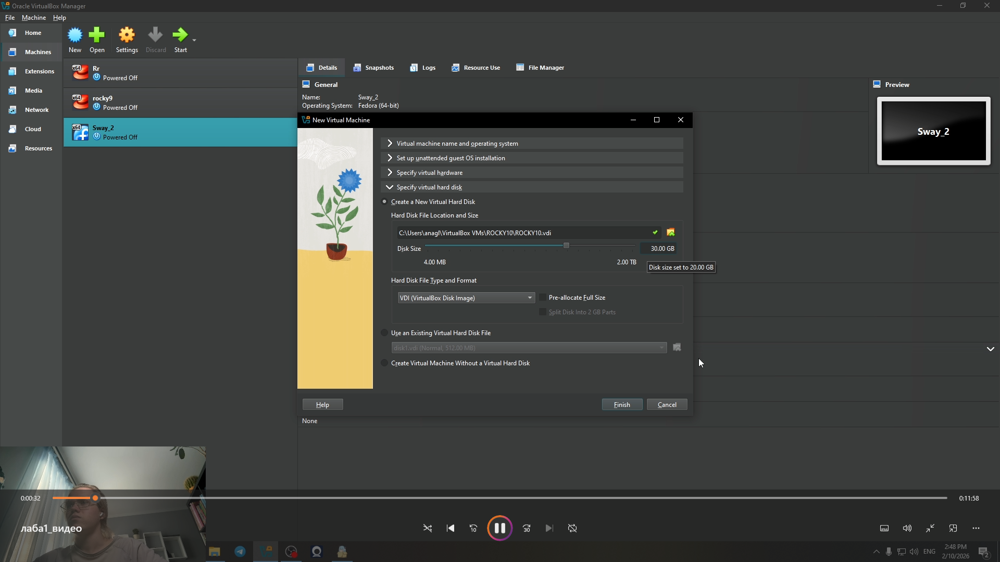
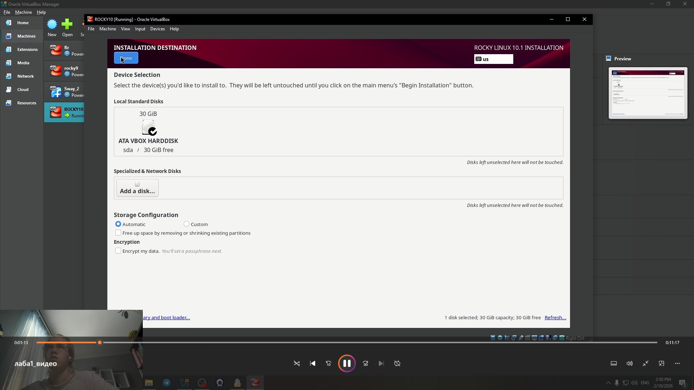
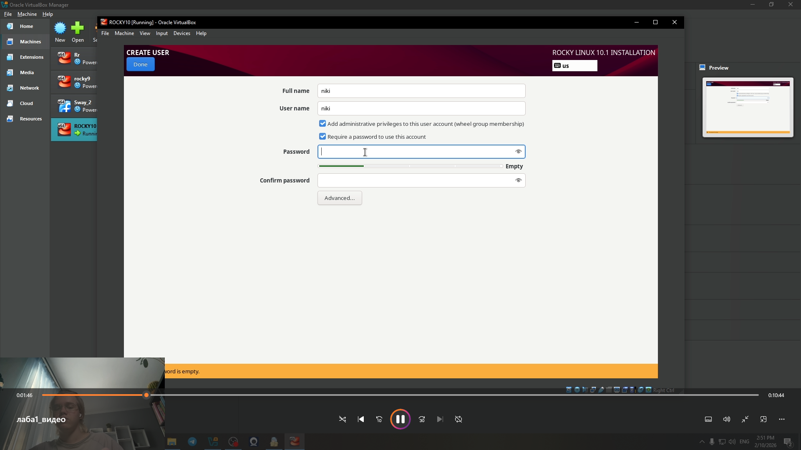
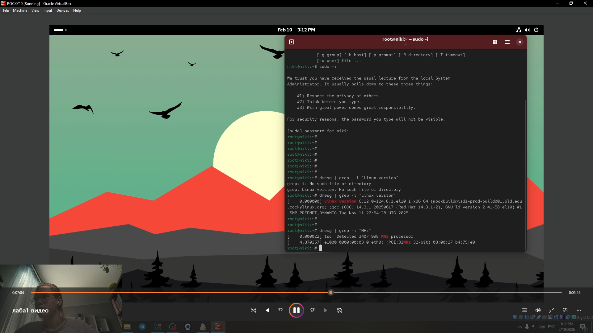
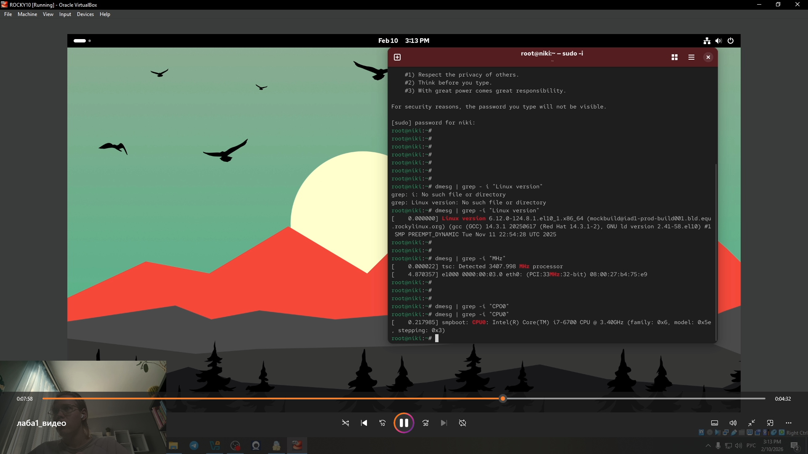
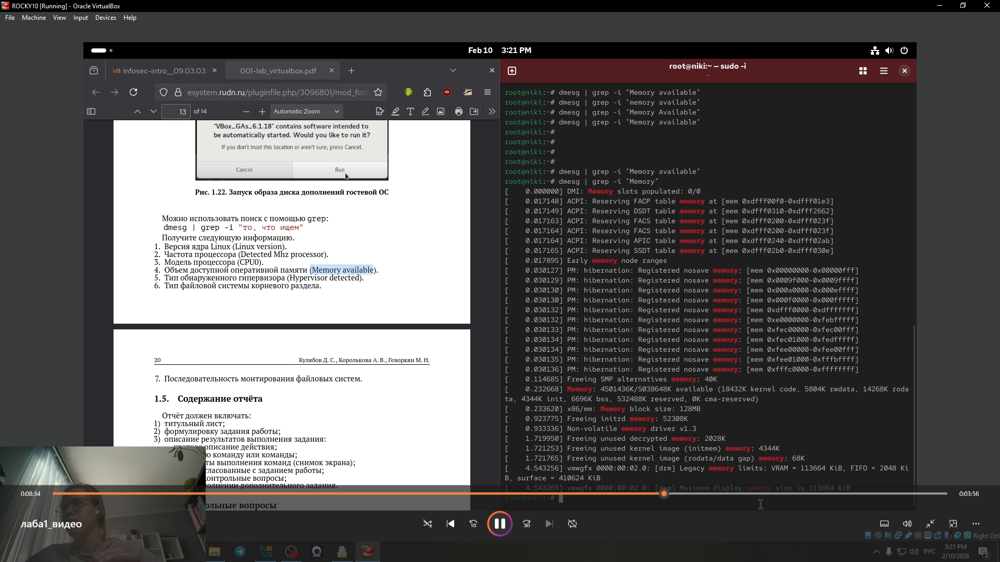
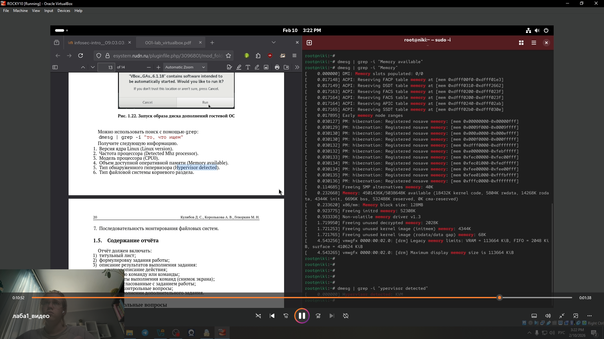

---
## Front matter
title: "Лабораторная работа № 1"
subtitle: "Установка и конфигурация операционной системы на виртуальную машину"
author: "Глобин Никита Анатольевич"

## Generic otions
lang: ru-RU
toc-title: "Содержание"

## Bibliography
bibliography: bib/cite.bib
csl: pandoc/csl/gost-r-7-0-5-2008-numeric.csl

## Pdf output format
toc: true # Table of contents
toc-depth: 2
lof: true # List of figures
lot: true # List of tables
fontsize: 12pt
linestretch: 1.5
papersize: a4
documentclass: scrreprt
## I18n polyglossia
polyglossia-lang:
  name: russian
  options:
	- spelling=modern
	- babelshorthands=true
polyglossia-otherlangs:
  name: english
## I18n babel
babel-lang: russian
babel-otherlangs: english
## Fonts
mainfont: IBM Plex Serif
romanfont: IBM Plex Serif
sansfont: IBM Plex Sans
monofont: IBM Plex Mono
mathfont: STIX Two Math
mainfontoptions: Ligatures=Common,Ligatures=TeX,Scale=0.94
romanfontoptions: Ligatures=Common,Ligatures=TeX,Scale=0.94
sansfontoptions: Ligatures=Common,Ligatures=TeX,Scale=MatchLowercase,Scale=0.94
monofontoptions: Scale=MatchLowercase,Scale=0.94,FakeStretch=0.9
mathfontoptions:
## Biblatex
biblatex: true
biblio-style: "gost-numeric"
biblatexoptions:
  - parentracker=true
  - backend=biber
  - hyperref=auto
  - language=auto
  - autolang=other*
  - citestyle=gost-numeric
## Pandoc-crossref LaTeX customization
figureTitle: "Рис."
tableTitle: "Таблица"
listingTitle: "Листинг"
lofTitle: "Список иллюстраций"
lotTitle: "Список таблиц"
lolTitle: "Листинги"
## Misc options
indent: true
header-includes:
  - \usepackage{indentfirst}
  - \usepackage{float} # keep figures where there are in the text
  - \floatplacement{figure}{H} # keep figures where there are in the text
---

# Цель работы

Целью данной работы является приобретение практических навыков
установки операционной системы на виртуальную машину, настройки ми-
нимально необходимых для дальнейшей работы сервисов.

# Задание

- устоновка виртуальной машины
- настройка
- контрольные вопросы 

# Выполнение лабораторной работы

## Устоновка системы

1. подключить образ(рис. [-@fig:001]).

{#fig:001 width=70%}

2. настроить размер хронилища (рис. [-@fig:002]).

{#fig:002 width=70%}

3. Запусть систему (рис. [-@fig:003]).

{#fig:003 width=70%}

4. работаем с устоновщиком линукс и подключаем хронилище  (рис. [-@fig:004]).

{#fig:004 width=70%}

5. Настраиваем пользователя root (рис. [-@fig:005]).

{#fig:005 width=70%}

6. Настраиваем нашего пользователя (рис. [-@fig:006]).

{#fig:006 width=70%}

7. Настраиваем сеть (рис. [-@fig:007]).

{#fig:007 width=70%}

## Домашнее задание

1. Версия ядра Linux (Linux version).(рис. [-@fig:007]).

{#fig:007 width=70%}

2. Частота процессора (Detected Mhz processor).(рис. [-@fig:007]).

{#fig:007 width=70%}

3. Модель процессора (CPU0).(рис. [-@fig:008]).

{#fig:008 width=70%}

4. Объем доступной оперативной памяти (Memory available).(рис. [-@fig:009]).

{#fig:009 width=70%}

5. Тип обнаруженного гипервизора (Hypervisor detected).(рис. [-@fig:010]).

{#fig:010 width=70%}

6. Тип файловой системы корневого раздела(рис. [-@fig:011]).

{#fig:011 width=70%}

7. Последовательность монтирования файловых систем.(рис. [-@fig:012]).

{#fig:012 width=70%}

## Контрольные вопросы

1. Учетная запись пользователя содержит информацию о его имени, идентификаторе (UID), группах, правам доступа и других параметрах.

2. Команды:

* для получения справки по команде: man <команда> или <команда> --help
* для перемещения по файловой системе: cd <путь>
* для просмотра содержимого каталога: ls
* для определения объёма каталога: du -sh <каталог>
* для создания каталога: mkdir <каталог>; для удаления каталога: rmdir <каталог> или rm -r <каталог>
* для создания файла: touch <файл>; для удаления файла: rm <файл>
* для задания прав на файл/каталог: chmod <права> <файл/каталог>
* для просмотра истории команд: history

3. Файловая система — это способ организации и хранения файлов на устройстве хранения данных. Примеры: ext4 (основная файловая система для Linux), NTFS (файловая система для Windows).

4. Для просмотра, какие файловые системы подмонтированы в ОС, используется команда: df -T

5. Для удаления зависшего процесса используется команда: kill или kill -9 

# Выводы

Здесь кратко описываются итоги проделанной работы.

# Список литературы{.unnumbered}

::: {#refs}
:::
