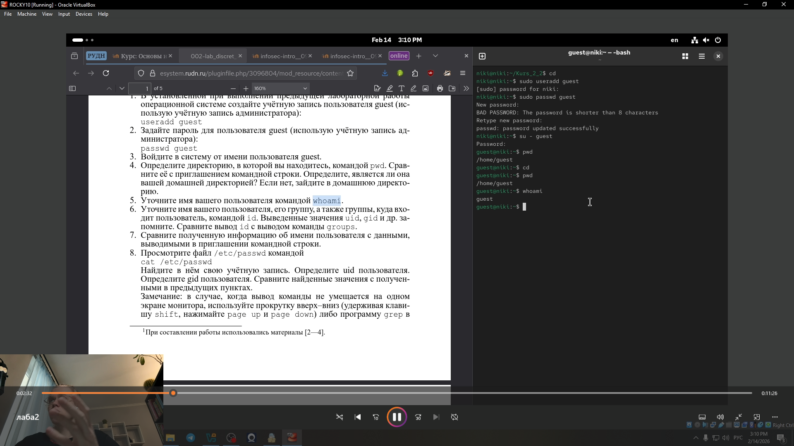
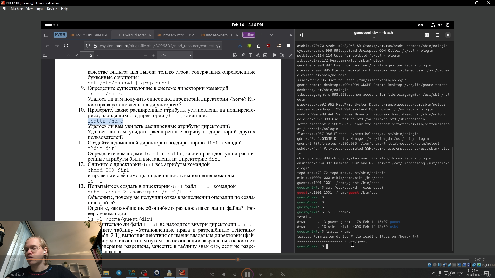
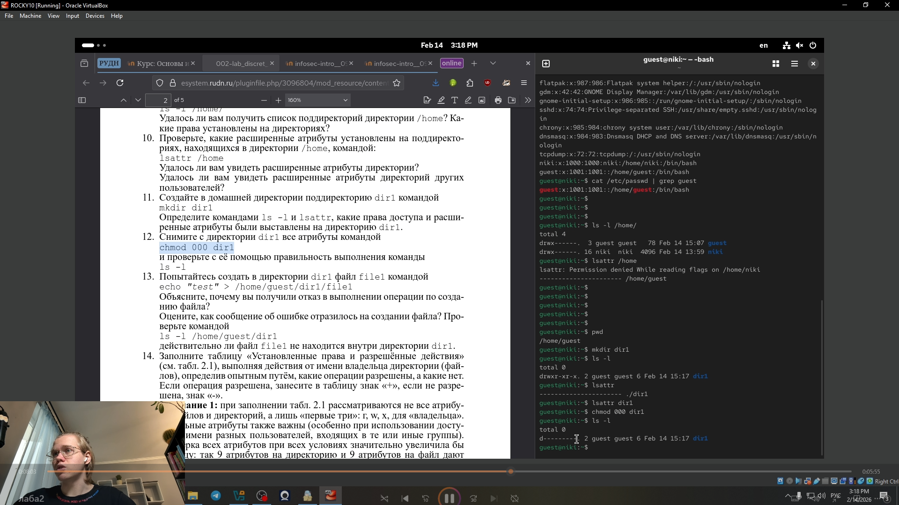
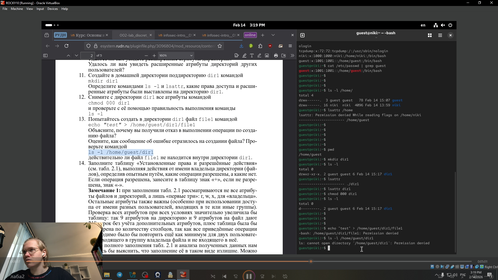

---
## Front matter
lang: ru-RU
title: Лабораторная работа № 2.
subtitle: Дискреционное
разграничение прав в Linux. Основные
атрибуты
author:
  - Глобин Н.А.
institute:
  - Российский университет дружбы народов, Москва, Россия

date: 14 02 2026

## i18n babel
babel-lang: russian
babel-otherlangs: english

## Formatting pdf
toc: false
toc-title: Содержание
slide_level: 2
aspectratio: 169
section-titles: true
theme: metropolis
header-includes:
 - \metroset{progressbar=frametitle,sectionpage=progressbar,numbering=fraction}
---

# Результаты

## Получающиеся форматы

- Полученный `pdf`-файл можно демонстрировать в любой программе просмотра `pdf`
- Полученный `html`-файл содержит в себе все ресурсы: изображения, css, скрипты

# Элементы презентации

## Цели и задачи

Получение практических навыков работы в консоли с атрибутами фай-
лов, закрепление теоретических основ дискреционного разграничения до-
ступа в современных системах с открытым кодом на базе ОС Linux1.

## Содержание исследования

1. В установленной при выполнении предыдущей лабораторной работы
операционной системе создайте учётную запись пользователя guest .

{width=70%}

## Содержание исследования

2. Задайте пароль для пользователя guest.

{width=70%}

## Содержание исследования

3. Войдите в систему от имени пользователя guest..

{width=70%}

## Содержание исследования

4. Определите директорию, в которой вы находитесь, командой pwd. Срав-
ните её с приглашением командной строки.

{width=70%}

## Содержание исследования

5. Уточните имя вашего пользователя командой whoam.

{width=70%}

## Содержание исследования

6. Уточните имя вашего пользователя, его группу, а также группы, куда вхо-
дит пользователь, командой id..

{width=70%}

## Содержание исследования

7. Сравните полученную информацию об имени пользователя с данными,
выводимыми в приглашении командной строки.

{width=70%}

## Содержание исследования

8. Просмотрите файл /etc/passwd командой cat /etc/passwd Найдите в нём свою учётную запись. .

{width=70%}

## Содержание исследования

9. Определите существующие в системе директории командой ls -l /home/ .

{width=70%}

## Содержание исследования

10. Проверьте, какие расширенные атрибуты установлены на поддиректо-
риях, находящихся в директории /home, командой: lsattr /home .

{width=70%}

## Содержание исследования

11. Создайте в домашней директории поддиректорию dir1 командой
mkdir dir1 Определите командами ls -l и lsattr, какие права доступа и расши-
ренные атрибуты были выставлены на директорию dir1..

{width=70%}

## Содержание исследования

12. Снимите с директории dir1 все атрибуты командой
chmod 000 dir1
и проверьте с её помощью правильность выполнения команды
ls -l.

{width=70%}

## Содержание исследования

13. Попытайтесь создать в директории dir1 файл file1 командой
echo "test" > /home/guest/dir1/file1 Объясните, почему вы получили отказ в выполнении операции по созданию файла? .

{width=70%}

## Содержание исследования

14. Заполните таблицу  .

{width=70%}

## Результаты

В ходе лабораторной работы были получены практические навыки управления дискреционными правами доступа в Linux, изучены основные атрибуты файлов и директорий, а также проанализирована взаимосвязь между установленными правами (r, w, x) и разрешёнными операциями. Экспериментальным путём установлено, какие минимальные права необходимы для выполнения различных действий с файлами и каталогами, что позволило закрепить теоретические основы разграничения доступа в системе.

