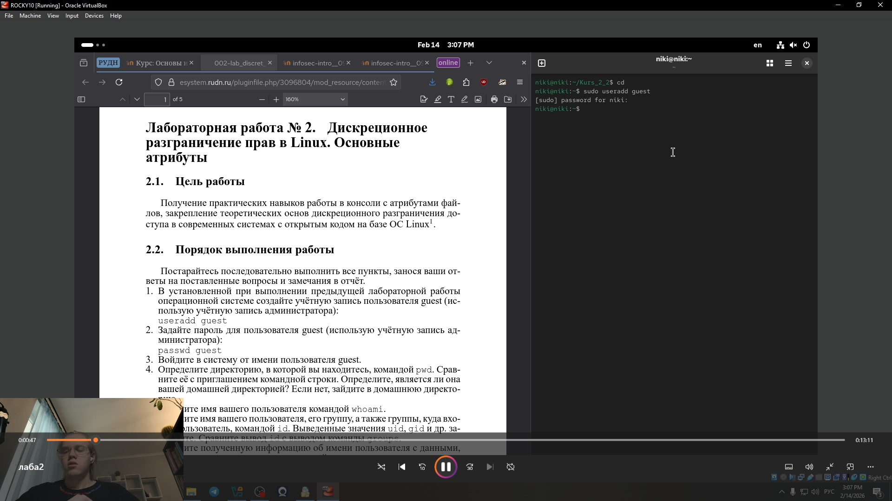
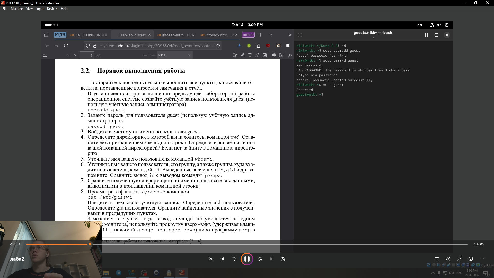
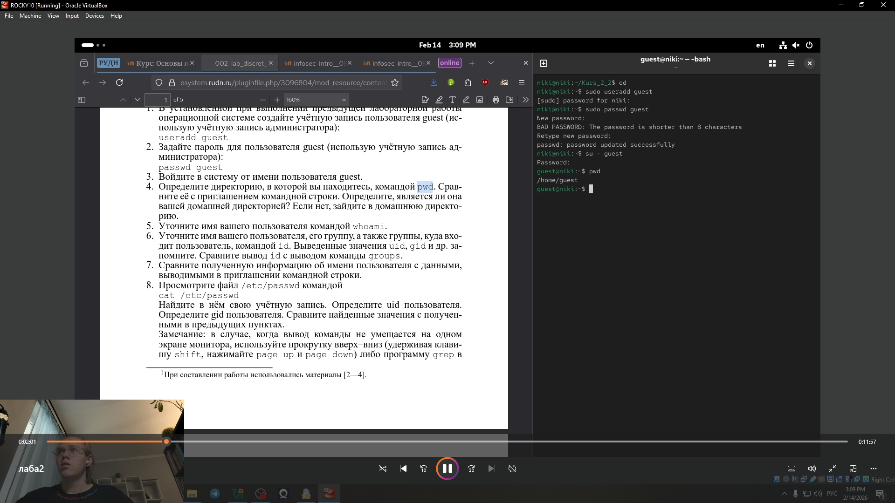
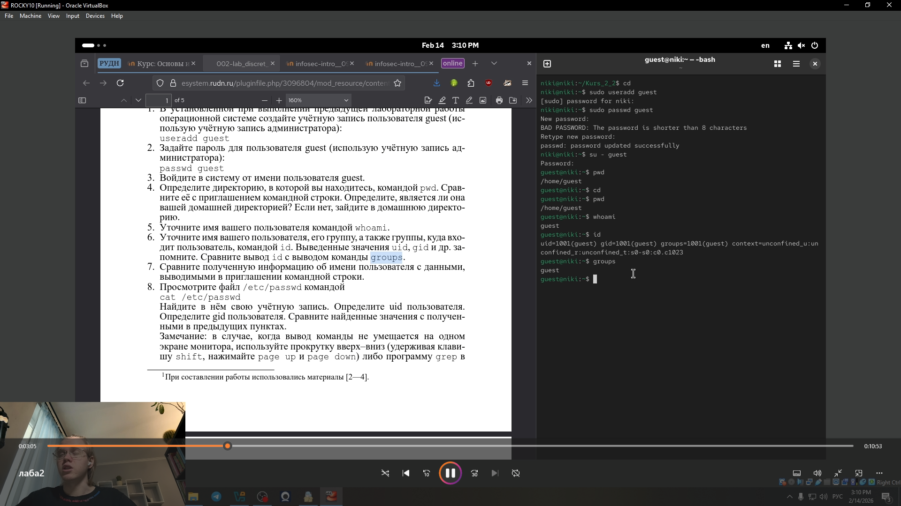
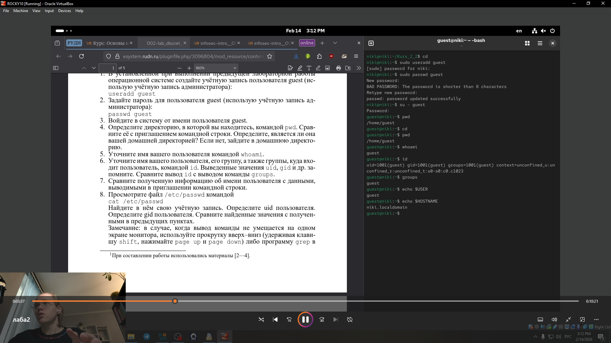
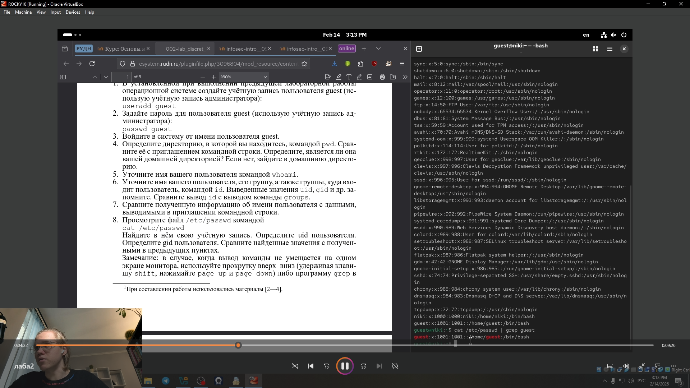
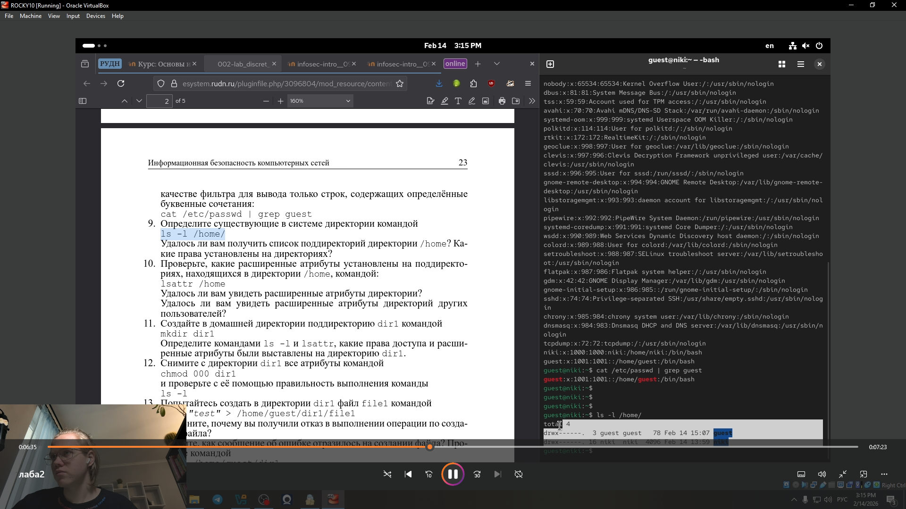
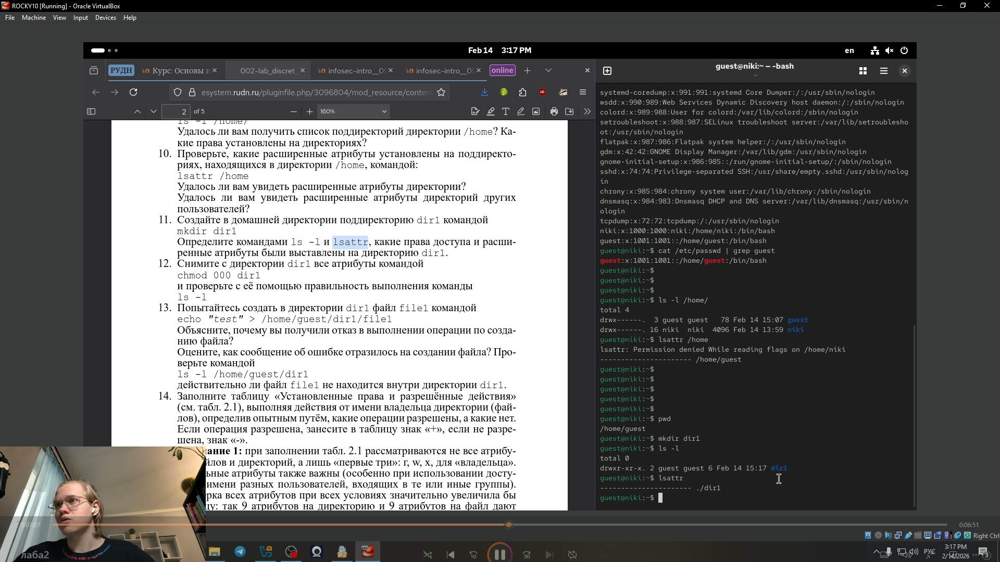
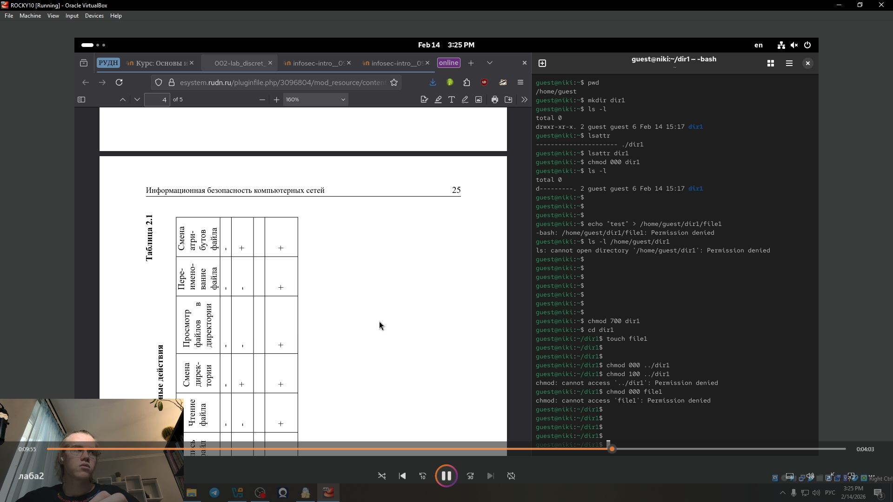

---
## Front matter
title: "Лабораторная работа № 2"
subtitle: "Дискреционное
разграничение прав в Linux. Основные
атрибуты"
author: "Глобин Никита Анатольевич"

## Generic otions
lang: ru-RU
toc-title: "Содержание"

## Bibliography
bibliography: bib/cite.bib
csl: pandoc/csl/gost-r-7-0-5-2008-numeric.csl

## Pdf output format
toc: true # Table of contents
toc-depth: 2
lof: true # List of figures
lot: true # List of tables
fontsize: 12pt
linestretch: 1.5
papersize: a4
documentclass: scrreprt
## I18n polyglossia
polyglossia-lang:
  name: russian
  options:
	- spelling=modern
	- babelshorthands=true
polyglossia-otherlangs:
  name: english
## I18n babel
babel-lang: russian
babel-otherlangs: english
## Fonts
mainfont: IBM Plex Serif
romanfont: IBM Plex Serif
sansfont: IBM Plex Sans
monofont: IBM Plex Mono
mathfont: STIX Two Math
mainfontoptions: Ligatures=Common,Ligatures=TeX,Scale=0.94
romanfontoptions: Ligatures=Common,Ligatures=TeX,Scale=0.94
sansfontoptions: Ligatures=Common,Ligatures=TeX,Scale=MatchLowercase,Scale=0.94
monofontoptions: Scale=MatchLowercase,Scale=0.94,FakeStretch=0.9
mathfontoptions:
## Biblatex
biblatex: true
biblio-style: "gost-numeric"
biblatexoptions:
  - parentracker=true
  - backend=biber
  - hyperref=auto
  - language=auto
  - autolang=other*
  - citestyle=gost-numeric
## Pandoc-crossref LaTeX customization
figureTitle: "Рис."
tableTitle: "Таблица"
listingTitle: "Листинг"
lofTitle: "Список иллюстраций"
lotTitle: "Список таблиц"
lolTitle: "Листинги"
## Misc options
indent: true
header-includes:
  - \usepackage{indentfirst}
  - \usepackage{float} # keep figures where there are in the text
  - \floatplacement{figure}{H} # keep figures where there are in the text
---

# Цель работы

Получение практических навыков работы в консоли с атрибутами фай-
лов, закрепление теоретических основ дискреционного разграничения до-
ступа в современных системах с открытым кодом на базе ОС Linux1.

# Выполнение лабораторной работы

1. В установленной при выполнении предыдущей лабораторной работы
операционной системе создайте учётную запись пользователя guest (рис. [-@fig:001]).

{#fig:001 width=70%}

2. Задайте пароль для пользователя guest(рис. [-@fig:002]).

{#fig:002 width=70%}

3. Войдите в систему от имени пользователя guest.(рис. [-@fig:003]).

{#fig:003 width=70%}

4. Определите директорию, в которой вы находитесь, командой pwd. Срав-
ните её с приглашением командной строки(рис. [-@fig:004]).

{#fig:004 width=70%}

5. Уточните имя вашего пользователя командой whoam(рис. [-@fig:005]).

{#fig:005 width=70%}

6. Уточните имя вашего пользователя, его группу, а также группы, куда вхо-
дит пользователь, командой id.(рис. [-@fig:006]).

{#fig:006 width=70%}

7. Сравните полученную информацию об имени пользователя с данными,
выводимыми в приглашении командной строки(рис. [-@fig:007]).

{#fig:007 width=70%}

8. Просмотрите файл /etc/passwd командой cat /etc/passwd Найдите в нём свою учётную запись. (рис. [-@fig:008]).

{#fig:008 width=70%}

9. Определите существующие в системе директории командой ls -l /home/ (рис. [-@fig:009]).

{#fig:009 width=70%}

10. Проверьте, какие расширенные атрибуты установлены на поддиректо-
риях, находящихся в директории /home, командой: lsattr /home (рис. [-@fig:010]).

{#fig:010 width=70%}

11. Создайте в домашней директории поддиректорию dir1 командой
mkdir dir1 Определите командами ls -l и lsattr, какие права доступа и расши-
ренные атрибуты были выставлены на директорию dir1.(рис. [-@fig:011]).

{#fig:011 width=70%}

12. Снимите с директории dir1 все атрибуты командой
chmod 000 dir1
и проверьте с её помощью правильность выполнения команды
ls -l(рис. [-@fig:012]).

{#fig:012 width=70%}

13. Попытайтесь создать в директории dir1 файл file1 командой
echo "test" > /home/guest/dir1/file1 Объясните, почему вы получили отказ в выполнении операции по созданию файла? (рис. [-@fig:013]).

{#fig:013 width=70%}

14. Заполните таблицу  (рис. [-@fig:014]).

{#fig:014 width=70%}

# Выводы

В ходе лабораторной работы были получены практические навыки управления дискреционными правами доступа в Linux, изучены основные атрибуты файлов и директорий, а также проанализирована взаимосвязь между установленными правами (r, w, x) и разрешёнными операциями. Экспериментальным путём установлено, какие минимальные права необходимы для выполнения различных действий с файлами и каталогами, что позволило закрепить теоретические основы разграничения доступа в системе.

