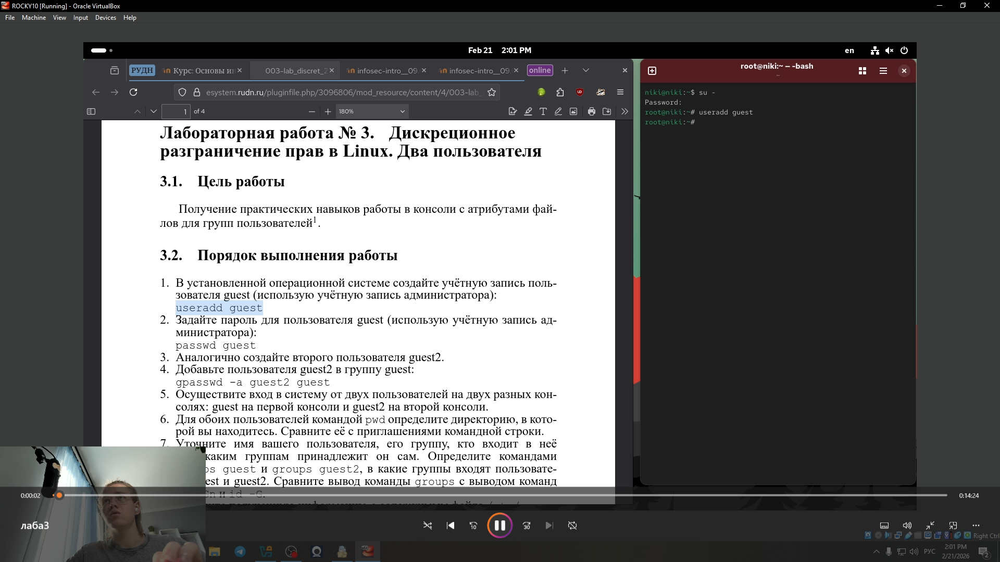
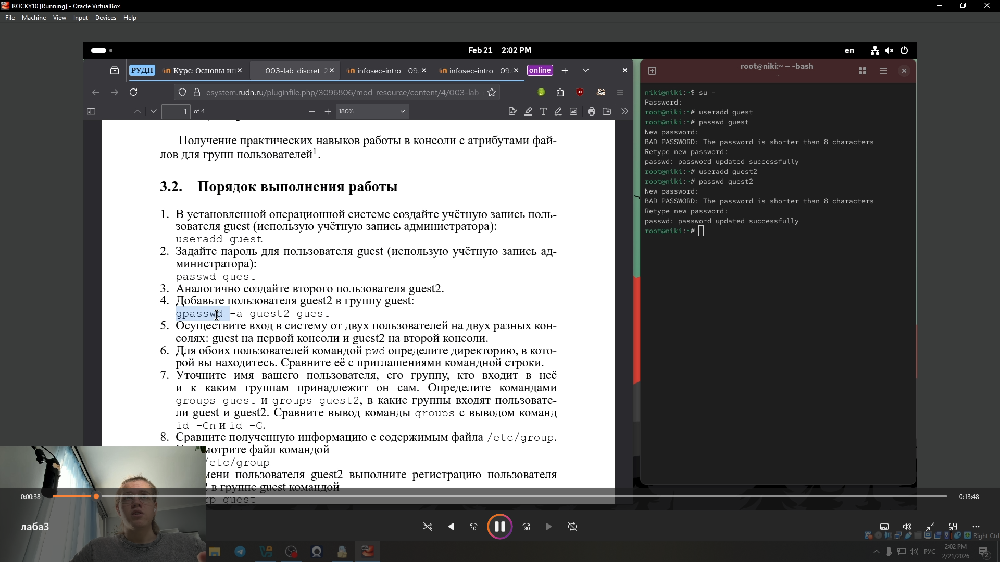
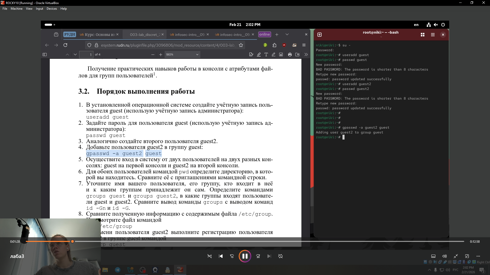
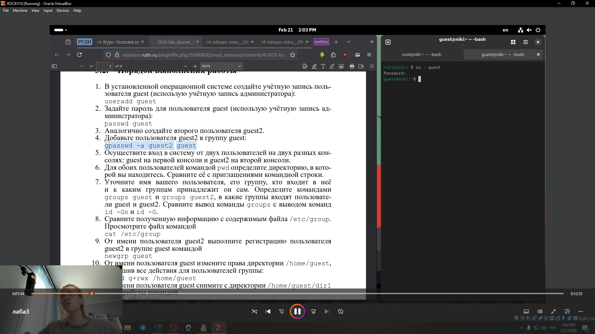
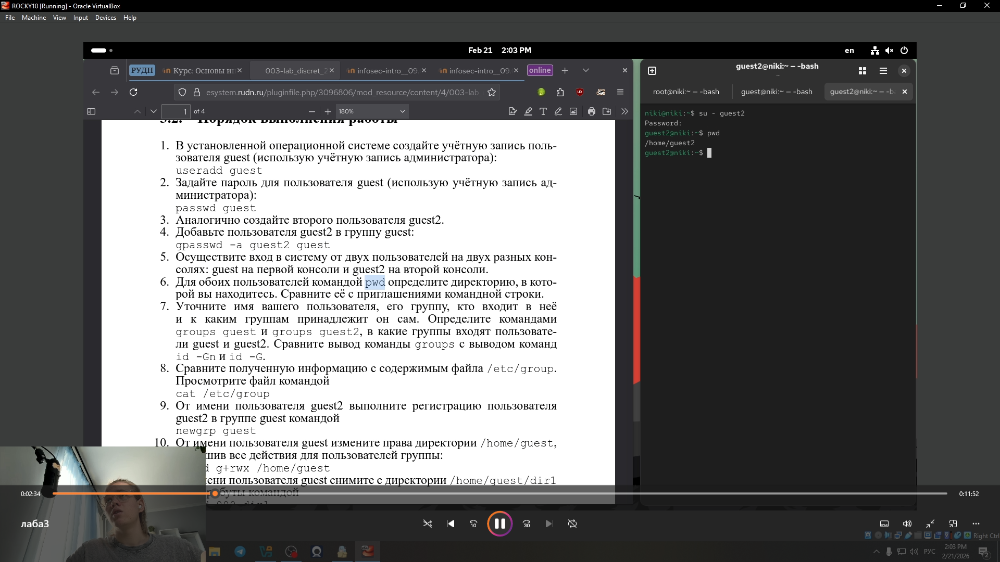
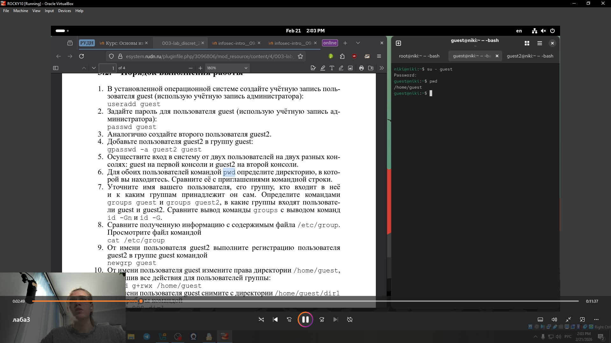
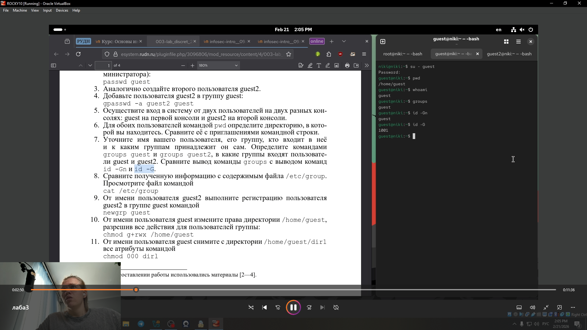
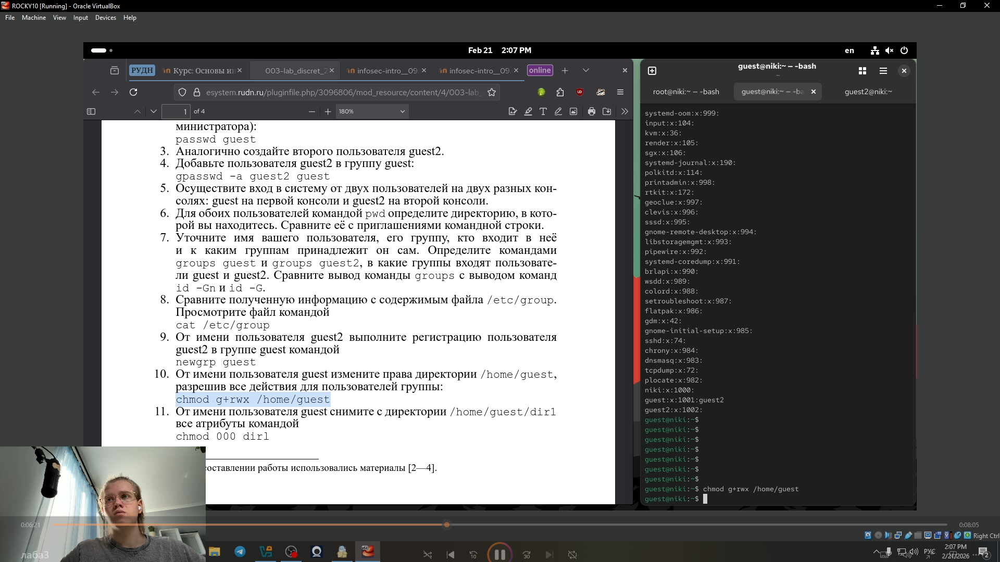
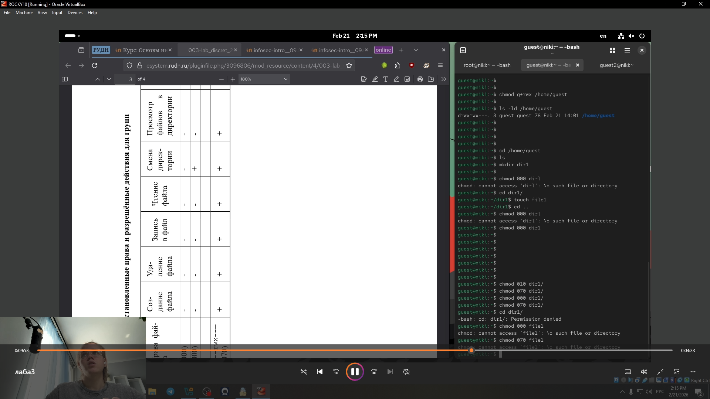
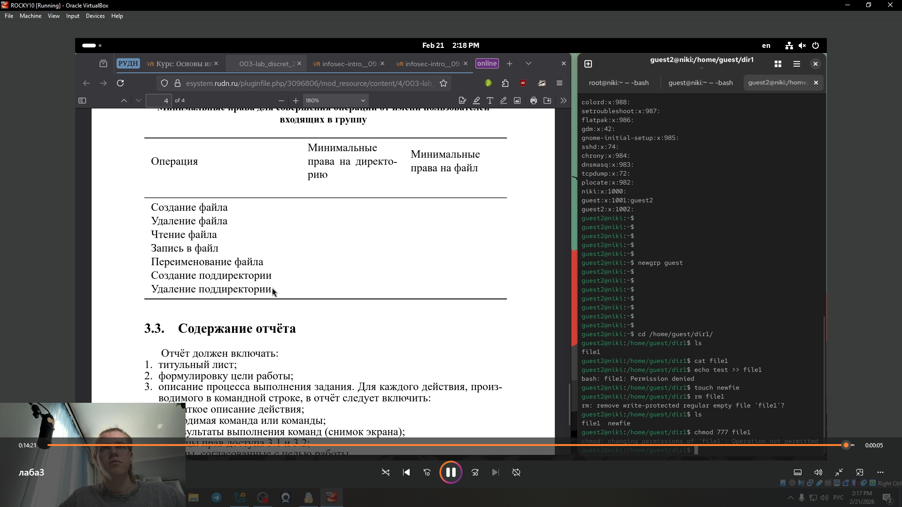

---
## Front matter
lang: ru-RU
title: Лабораторная работа № 3.
subtitle: Дискреционное
разграничение прав в Linux. Два пользователя
author:
  - Глобин Н.А.
institute:
  - Российский университет дружбы народов, Москва, Россия
date: 21 02 2026

## i18n babel
babel-lang: russian
babel-otherlangs: english

## Formatting pdf
toc: false
toc-title: Содержание
slide_level: 2
aspectratio: 169
section-titles: true
theme: metropolis
header-includes:
 - \metroset{progressbar=frametitle,sectionpage=progressbar,numbering=fraction}
---

# Информация

## Докладчик

  * Глобин Никита Анатольевич

# Результаты

## Получающиеся форматы

- Полученный `pdf`-файл можно демонстрировать в любой программе просмотра `pdf`
- Полученный `html`-файл содержит в себе все ресурсы: изображения, css, скрипты

# Элементы презентации

## Актуальность

- Получение практических навыков работы в консоли с атрибутами фай-
лов для групп пользователей

## Цели и задачи

- создать пользователей
- настроить пользователей 
- заполнение таблицы 

## Содержание исследования

1. В установленной операционной системе создайте учётную запись поль-
зователя guest (использую учётную запись администратора):
useradd guest

{ width=70%}

## Содержание исследования

2. Задайте пароль для пользователя guest (использую учётную запись ад-
министратора)

{ width=70%}

## Содержание исследования

3. Аналогично создайте второго пользователя guest2.

{ width=70%}

## Содержание исследования

4. Добавьте пользователя guest2 в группу guest

{ width=70%}

## Содержание исследования

5. Осуществите вход в систему от двух пользователей на двух разных кон-
солях: guest на первой консоли и guest2 на второй консоли.

{ width=70%}.

## Содержание исследования

{ width=70%}

## Содержание исследования

6. Для обоих пользователей командой pwd определите директорию, в кото-
рой вы находитесь. .

{ width=70%}.

## Содержание исследования

{ width=70%}

## Содержание исследования

7. Уточните имя вашего пользователя, его группу, кто входит в неё
и к каким группам принадлежит он сам. .

{ width=70%}.

## Содержание исследования

{ width=70%}

## Содержание исследования

8. Сравните полученную информацию с содержимым файла /etc/group.
Просмотрите файл командой cat /etc/group .

{ width=70%}.

## Содержание исследования

{ width=70%}

## Содержание исследования

9. От имени пользователя guest2 выполните регистрацию пользователя
guest2 в группе guest.

{ width=70%}.

## Содержание исследования

10. От имени пользователя guest измените права директории /home/guest,
разрешив все действия для пользователей группы:
chmod g+rwx /home/guest.

{ width=70%}.

## Содержание исследования

11. От имени пользователя guest снимите с директории /home/guest/dir1
все атрибуты .

{ width=70%}.

## Содержание исследования

12. запонение таблицы .

{ width=70%}.

## Содержание исследования

{ width=70%}.

## Результаты

- Не нужны все результаты
- Необходимы логические связки между слайдами
- Необходимо показать понимание материала

