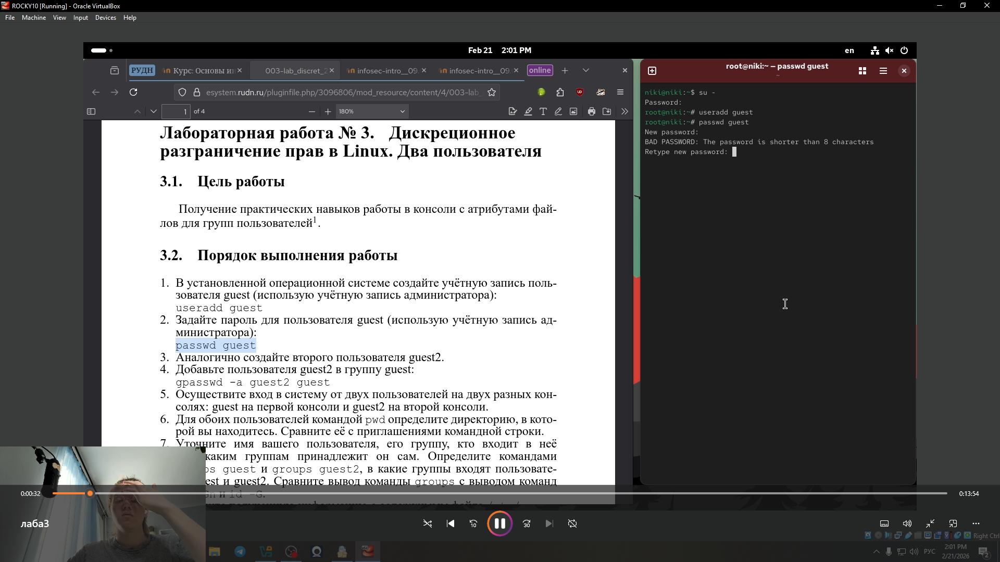
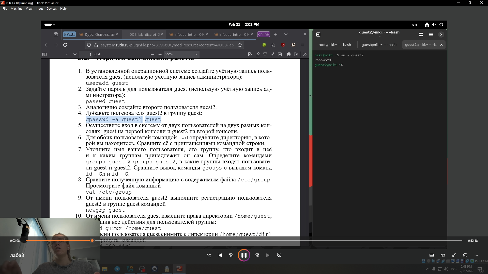
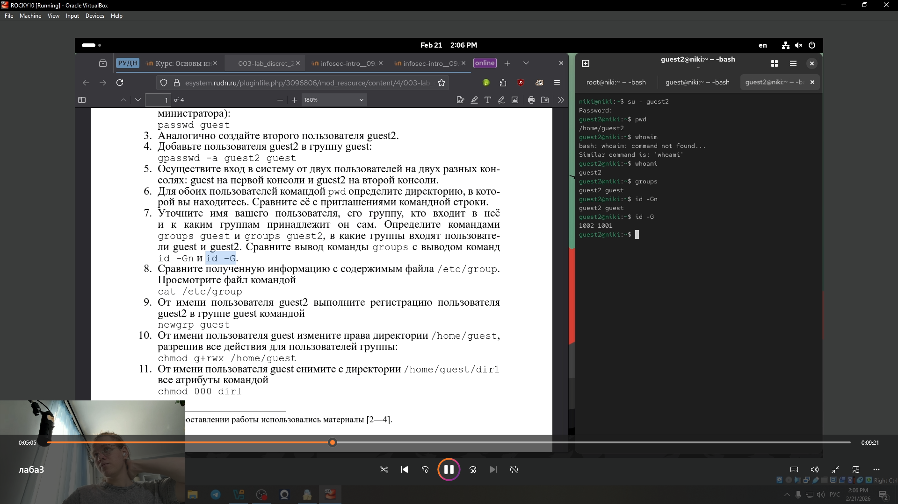
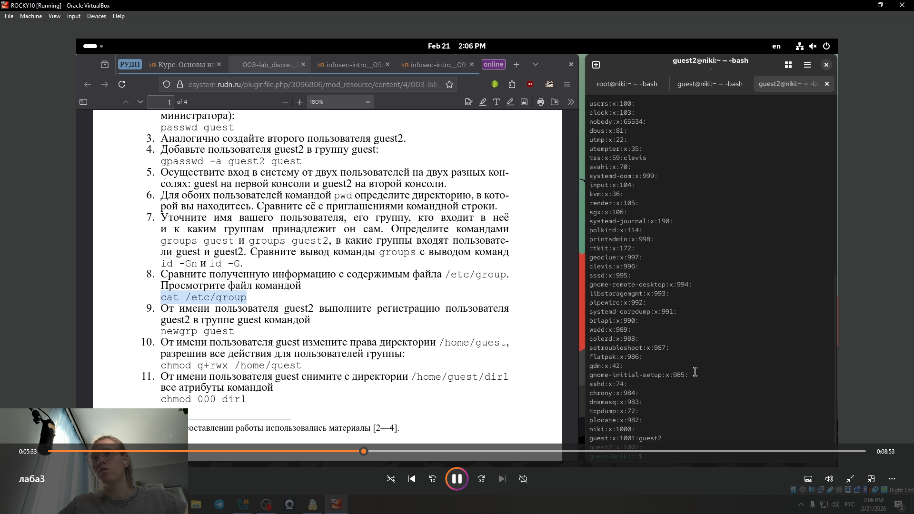
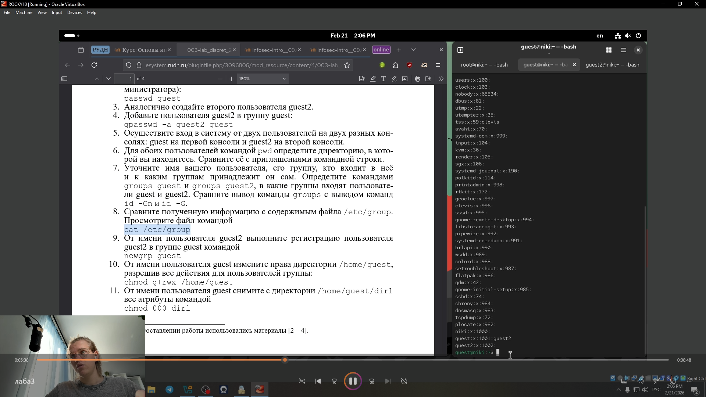
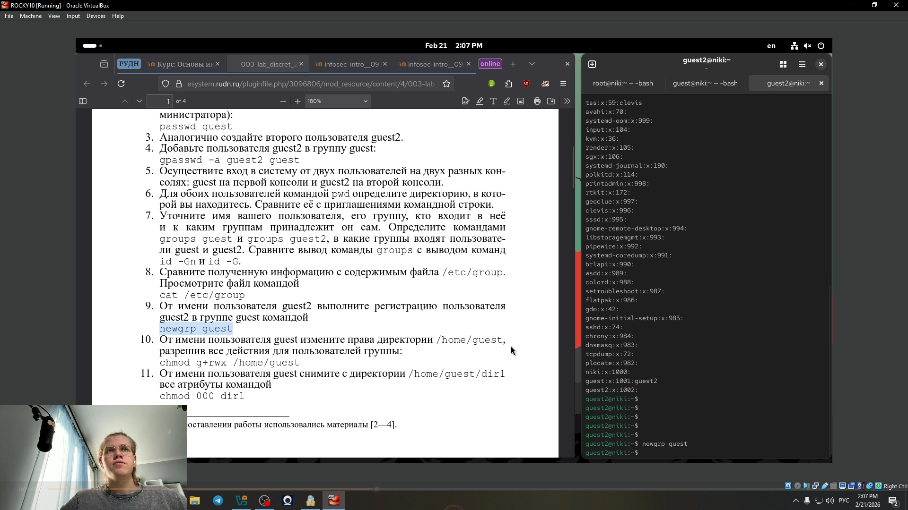
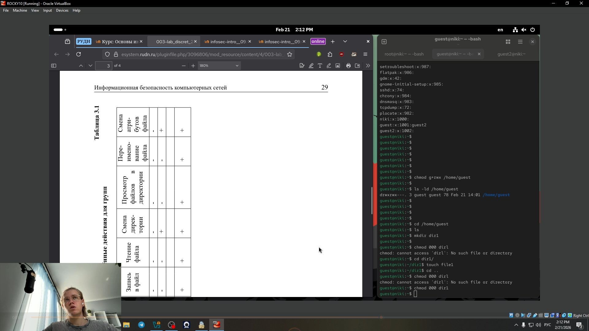

---
## Front matter
title: "Лабораторная работа № 3"
subtitle: "Дискреционное разграничение прав в Linux. Два пользователя"
author: "Глобин Никита Анатольевич"

## Generic otions
lang: ru-RU
toc-title: "Содержание"

## Bibliography
bibliography: bib/cite.bib
csl: pandoc/csl/gost-r-7-0-5-2008-numeric.csl

## Pdf output format
toc: true # Table of contents
toc-depth: 2
lof: true # List of figures
lot: true # List of tables
fontsize: 12pt
linestretch: 1.5
papersize: a4
documentclass: scrreprt
## I18n polyglossia
polyglossia-lang:
  name: russian
  options:
	- spelling=modern
	- babelshorthands=true
polyglossia-otherlangs:
  name: english
## I18n babel
babel-lang: russian
babel-otherlangs: english
## Fonts
mainfont: IBM Plex Serif
romanfont: IBM Plex Serif
sansfont: IBM Plex Sans
monofont: IBM Plex Mono
mathfont: STIX Two Math
mainfontoptions: Ligatures=Common,Ligatures=TeX,Scale=0.94
romanfontoptions: Ligatures=Common,Ligatures=TeX,Scale=0.94
sansfontoptions: Ligatures=Common,Ligatures=TeX,Scale=MatchLowercase,Scale=0.94
monofontoptions: Scale=MatchLowercase,Scale=0.94,FakeStretch=0.9
mathfontoptions:
## Biblatex
biblatex: true
biblio-style: "gost-numeric"
biblatexoptions:
  - parentracker=true
  - backend=biber
  - hyperref=auto
  - language=auto
  - autolang=other*
  - citestyle=gost-numeric
## Pandoc-crossref LaTeX customization
figureTitle: "Рис."
tableTitle: "Таблица"
listingTitle: "Листинг"
lofTitle: "Список иллюстраций"
lotTitle: "Список таблиц"
lolTitle: "Листинги"
## Misc options
indent: true
header-includes:
  - \usepackage{indentfirst}
  - \usepackage{float} # keep figures where there are in the text
  - \floatplacement{figure}{H} # keep figures where there are in the text
---

# Цель работы

Получение практических навыков работы в консоли с атрибутами фай-
лов для групп пользователей

# Задание

- создать пользователей
- настроить пользователей 
- заполнение таблицы 

# Выполнение лабораторной работы

1. В установленной операционной системе создайте учётную запись поль-
зователя guest (использую учётную запись администратора):
useradd guest(рис. [-@fig:001]).

{#fig:001 width=70%}

2. Задайте пароль для пользователя guest (использую учётную запись ад-
министратора)(рис. [-@fig:002]).

{#fig:002 width=70%}

3. Аналогично создайте второго пользователя guest2.(рис. [-@fig:003]).

{#fig:003 width=70%}

4. Добавьте пользователя guest2 в группу guest(рис. [-@fig:004]).

{#fig:004 width=70%}

5. Осуществите вход в систему от двух пользователей на двух разных кон-
солях: guest на первой консоли и guest2 на второй консоли(рис. [-@fig:005])(рис. [-@fig:006]).

{#fig:005 width=70%}.

{#fig:006 width=70%}

6. Для обоих пользователей командой pwd определите директорию, в кото-
рой вы находитесь. (рис. [-@fig:007])(рис. [-@fig:008]).

{#fig:007 width=70%}.

{#fig:008 width=70%}

7. Уточните имя вашего пользователя, его группу, кто входит в неё
и к каким группам принадлежит он сам. (рис. [-@fig:009])(рис. [-@fig:010]).

{#fig:009 width=70%}.

{#fig:010 width=70%}

8. Сравните полученную информацию с содержимым файла /etc/group.
Просмотрите файл командой cat /etc/group (рис. [-@fig:011])(рис. [-@fig:012]).

{#fig:011 width=70%}.

{#fig:012 width=70%}

9. От имени пользователя guest2 выполните регистрацию пользователя
guest2 в группе guest(рис. [-@fig:013]).

{#fig:013 width=70%}.

10. От имени пользователя guest измените права директории /home/guest,
разрешив все действия для пользователей группы:
chmod g+rwx /home/guest(рис. [-@fig:014]).

{#fig:014 width=70%}.

11. От имени пользователя guest снимите с директории /home/guest/dir1
все атрибуты (рис. [-@fig:015]).

{#fig:015 width=70%}.

12. запонение таблицы (рис. [-@fig:016]).(рис. [-@fig:017])

{#fig:016 width=70%}.

{#fig:017 width=70%}.

# Выводы

В ходе лабораторной работы были получены практические навыки управления дисреционным доступом в Linux для нескольких пользователей, входящих в общую группу. Экспериментально определено влияние комбинаций атрибутов доступа к директориям и файлам на возможности пользователя guest2 по выполнению различных операций. Результаты заполненных таблиц наглядно демонстрируют, что права на директорию (в частности, наличие бита x) являются определяющими для возможности взаимодействия с содержащимися в ней файлами.

