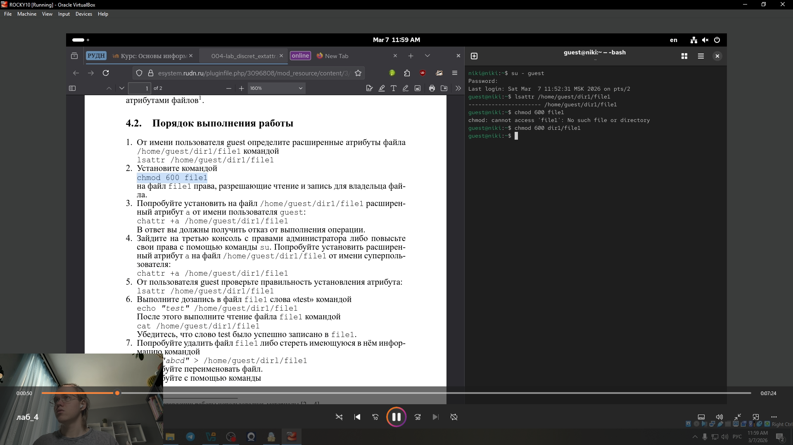
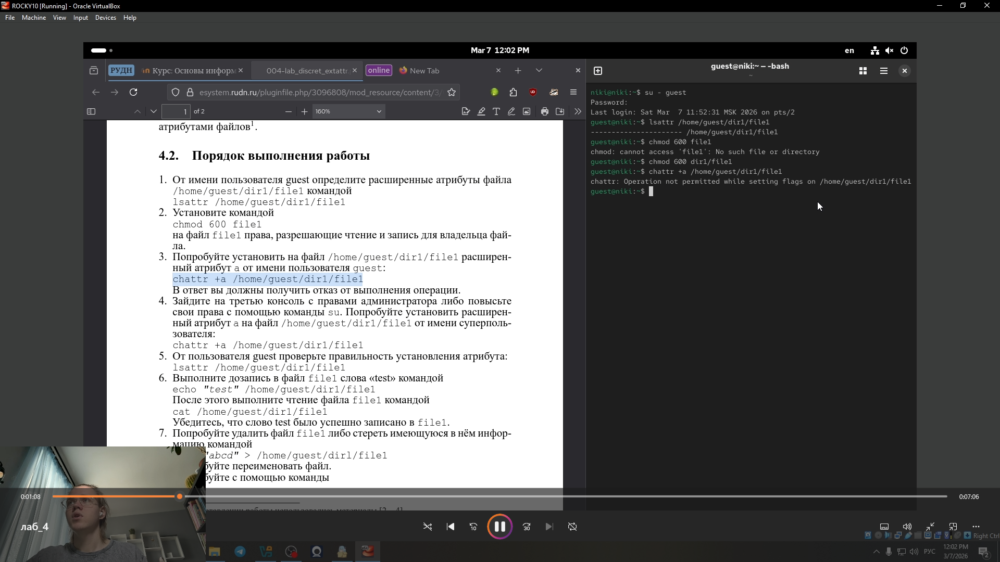
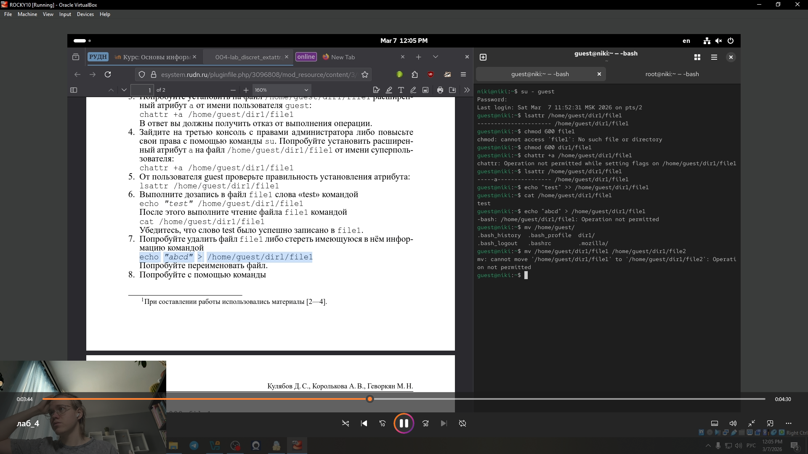
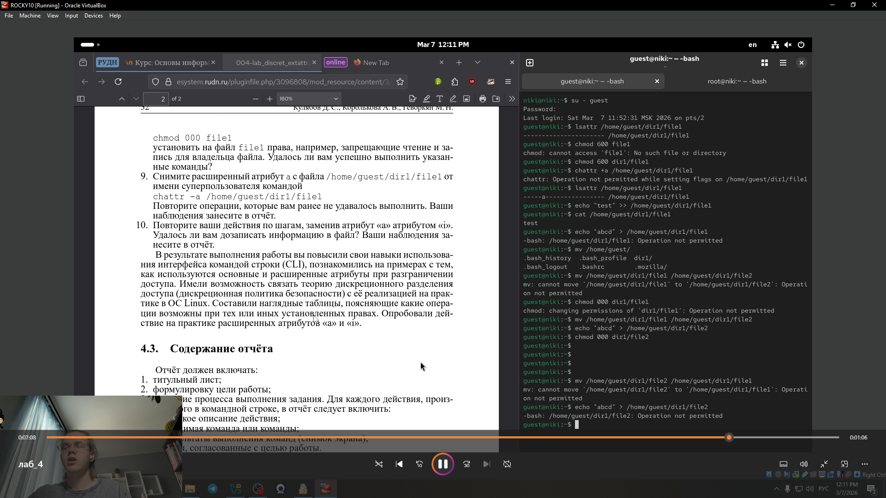

---
## Front matter
lang: ru-RU
title: Структура научной презентации
subtitle: Простейший шаблон
author:
  - Глобин Н.А.
institute:
  - Российский университет дружбы народов, Москва, Россия

date: 07 03 2026

## i18n babel
babel-lang: russian
babel-otherlangs: english

## Formatting pdf
toc: false
toc-title: Содержание
slide_level: 2
aspectratio: 169
section-titles: true
theme: metropolis
header-includes:
 - \metroset{progressbar=frametitle,sectionpage=progressbar,numbering=fraction}
---

# Информация


# Создание презентации

## Процессор `pandoc`

- Pandoc: преобразователь текстовых файлов
- Сайт: <https://pandoc.org/>
- Репозиторий: <https://github.com/jgm/pandoc>

## Формат `pdf`

- Использование LaTeX
- Пакет для презентации: [beamer](https://ctan.org/pkg/beamer)
- Тема оформления: `metropolis`

## Код для формата `pdf`

```yaml
slide_level: 2
aspectratio: 169
section-titles: true
theme: metropolis
```

## Формат `html`

- Используется фреймворк [reveal.js](https://revealjs.com/)
- Используется [тема](https://revealjs.com/themes/) `beige`

## Код для формата `html`

- Тема задаётся в файле `Makefile`

```make
REVEALJS_THEME = beige 
```
# Результаты

## Получающиеся форматы

- Полученный `pdf`-файл можно демонстрировать в любой программе просмотра `pdf`
- Полученный `html`-файл содержит в себе все ресурсы: изображения, css, скрипты

# Элементы презентации


## Цели и задачи

- Получение практических навыков работы в консоли с расширенными
атрибутами файлов


## Содержание исследования

1. От имени пользователя guest определите расширенные атрибуты файларис.

{ width=70%}

## Содержание исследования


2. Установите командой
chmod 600 file1

{ width=70%}


## Содержание исследования


3. Попробуйте установить на файл /home/guest/dir1/file1 расширенный атрибут a от имени пользователя guest:
chattr +a /home/guest/dir1/file1

{ width=70%}


## Содержание исследования


4. Зайдите на третью консоль с правами администратора либо повысьте
свои права с помощью команды su. Попробуйте установить расширен-
ный атрибут a на файл /home/guest/dir1/file1 от имени суперполь-
зователя:
chattr +a /home/guest/dir1/file1

{ width=70%}

## Содержание исследования


5. От пользователя guest проверьте правильность установления атрибута:
lsattr /home/guest/dir1/file1

{ width=70%}

## Содержание исследования


6. Выполните дозапись в файл file1 слова «test» командой
echo "test" /home/guest/dir1/file1

{ width=70%}


## Содержание исследования


7. Попробуйте удалить файл file1 либо стереть имеющуюся в нём инфор-
мацию командой
echo "abcd" > /home/guest/dirl/file1

{ width=70%}


## Содержание исследования


8. Попробуйте с помощью команды

{ width=70%}


## Содержание исследования


9. Снимите расширенный атрибут a с файла /home/guest/dirl/file1 от
имени суперпользователя командой
chattr -a /home/guest/dir1/file1.

{ width=70%}

## Содержание исследования


{ width=70%}

## Содержание исследования


10. Повторите ваши действия по шагам, заменив атрибут «a» атрибутом «i».
Удалось ли вам дозаписать информацию в файл? Ваши наблюдения за-
несите в отчёт.

{ width=70%}

## Содержание исследования


{ width=70%}


## Результаты

результате выполнения работы вы повысили свои навыки использова-
ния интерфейса командой строки (CLI), познакомились на примерах с тем,
как используются основные и расширенные атрибуты при разграничении
доступа. Имели возможность связать теорию дискреционного разделения
доступа (дискреционная политика безопасности) с её реализацией на прак-
тике в ОС Linux. Составили наглядные таблицы, поясняющие какие опера-
ции возможны при тех или иных установленных правах. Опробовали дей-
ствие на практике расширенных атрибутов «а» и «i»


