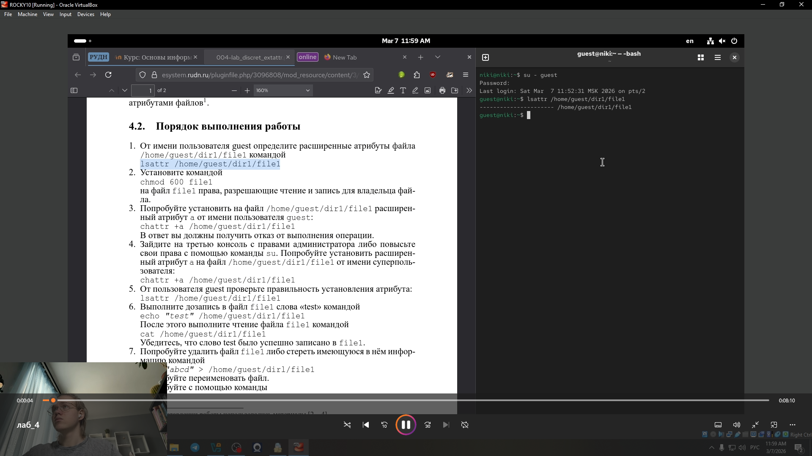
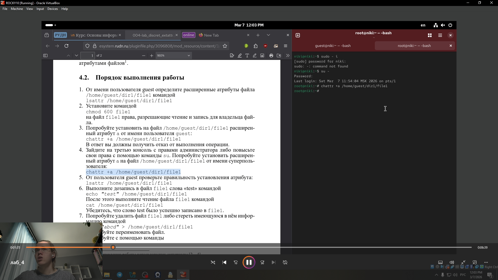
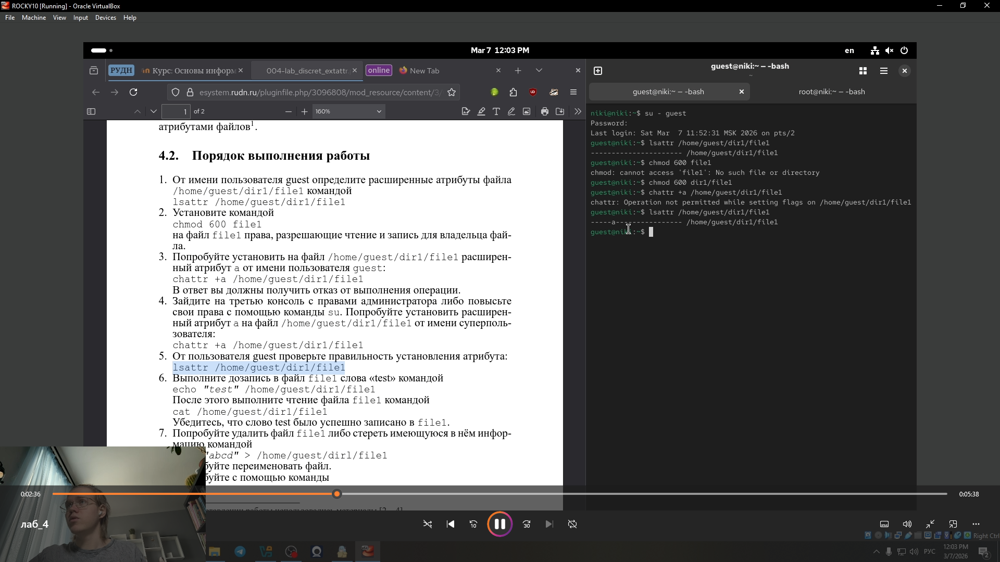
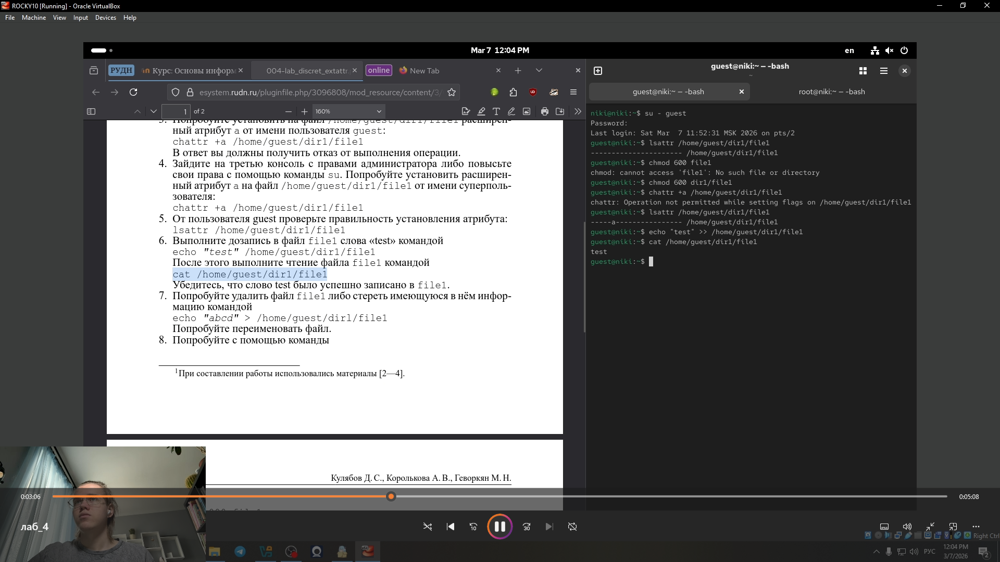
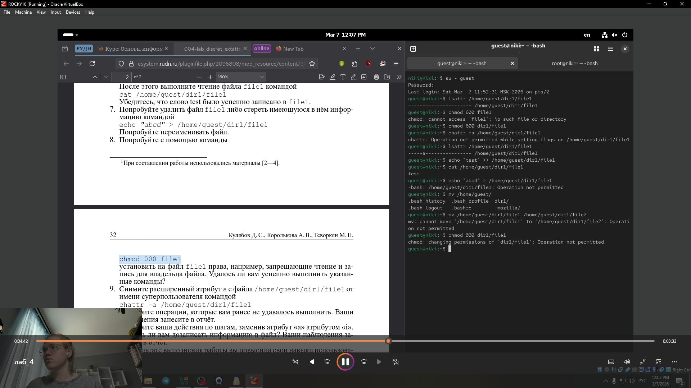
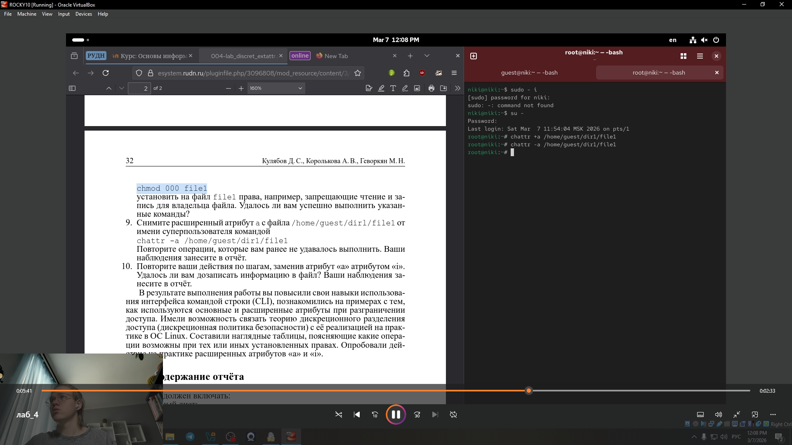
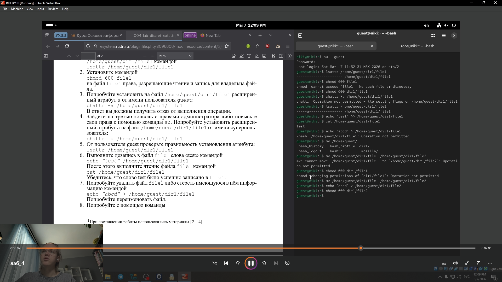
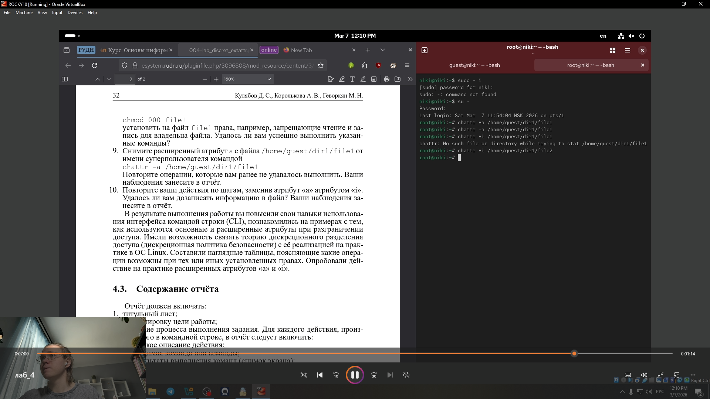

---
## Front matter
title: "Лабораторная работа № 4"
subtitle: "Дискреционное разграничение прав в Linux. Расширенные атрибуты"
author: "Глобин Никита Анатольевич"

## Generic otions
lang: ru-RU
toc-title: "Содержание"

## Bibliography
bibliography: bib/cite.bib
csl: pandoc/csl/gost-r-7-0-5-2008-numeric.csl

## Pdf output format
toc: true # Table of contents
toc-depth: 2
lof: true # List of figures
lot: true # List of tables
fontsize: 12pt
linestretch: 1.5
papersize: a4
documentclass: scrreprt
## I18n polyglossia
polyglossia-lang:
  name: russian
  options:
	- spelling=modern
	- babelshorthands=true
polyglossia-otherlangs:
  name: english
## I18n babel
babel-lang: russian
babel-otherlangs: english
## Fonts
mainfont: IBM Plex Serif
romanfont: IBM Plex Serif
sansfont: IBM Plex Sans
monofont: IBM Plex Mono
mathfont: STIX Two Math
mainfontoptions: Ligatures=Common,Ligatures=TeX,Scale=0.94
romanfontoptions: Ligatures=Common,Ligatures=TeX,Scale=0.94
sansfontoptions: Ligatures=Common,Ligatures=TeX,Scale=MatchLowercase,Scale=0.94
monofontoptions: Scale=MatchLowercase,Scale=0.94,FakeStretch=0.9
mathfontoptions:
## Biblatex
biblatex: true
biblio-style: "gost-numeric"
biblatexoptions:
  - parentracker=true
  - backend=biber
  - hyperref=auto
  - language=auto
  - autolang=other*
  - citestyle=gost-numeric
## Pandoc-crossref LaTeX customization
figureTitle: "Рис."
tableTitle: "Таблица"
listingTitle: "Листинг"
lofTitle: "Список иллюстраций"
lotTitle: "Список таблиц"
lolTitle: "Листинги"
## Misc options
indent: true
header-includes:
  - \usepackage{indentfirst}
  - \usepackage{float} # keep figures where there are in the text
  - \floatplacement{figure}{H} # keep figures where there are in the text
---

# Цель работы

Получение практических навыков работы в консоли с расширенными
атрибутами файлов

# Задание

- Получение практических навыков работы в консоли с расширенными
атрибутами файлов

# Выполнение лабораторной работы

1. От имени пользователя guest определите расширенные атрибуты файларис.([-@fig:001]).

{#fig:001 width=70%}

2. Установите командой
chmod 600 file1([-@fig:002]).

{#fig:002 width=70%}

3. Попробуйте установить на файл /home/guest/dir1/file1 расширенный атрибут a от имени пользователя guest:
chattr +a /home/guest/dir1/file1([-@fig:003]).

{#fig:003 width=70%}

4. Зайдите на третью консоль с правами администратора либо повысьте
свои права с помощью команды su. Попробуйте установить расширен-
ный атрибут a на файл /home/guest/dir1/file1 от имени суперполь-
зователя:
chattr +a /home/guest/dir1/file1([-@fig:004]).

{#fig:004 width=70%}

5. От пользователя guest проверьте правильность установления атрибута:
lsattr /home/guest/dir1/file1([-@fig:005]).

{#fig:005 width=70%}

6. Выполните дозапись в файл file1 слова «test» командой
echo "test" /home/guest/dir1/file1([-@fig:006]).

{#fig:006 width=70%}

7. Попробуйте удалить файл file1 либо стереть имеющуюся в нём инфор-
мацию командой
echo "abcd" > /home/guest/dirl/file1([-@fig:007]).

{#fig:007 width=70%}

8. Попробуйте с помощью команды([-@fig:008]).

{#fig:008 width=70%}

9. Снимите расширенный атрибут a с файла /home/guest/dirl/file1 от
имени суперпользователя командой
chattr -a /home/guest/dir1/file1([-@fig:009])([-@fig:010]).

{#fig:009 width=70%}

{#fig:010 width=70%}

10. Повторите ваши действия по шагам, заменив атрибут «a» атрибутом «i».
Удалось ли вам дозаписать информацию в файл? Ваши наблюдения за-
несите в отчёт([-@fig:011])([-@fig:012]).

{#fig:011 width=70%}

{#fig:012 width=70%}

# Выводы

 результате выполнения работы вы повысили свои навыки использова-
ния интерфейса командой строки (CLI), познакомились на примерах с тем,
как используются основные и расширенные атрибуты при разграничении
доступа. Имели возможность связать теорию дискреционного разделения
доступа (дискреционная политика безопасности) с её реализацией на прак-
тике в ОС Linux. Составили наглядные таблицы, поясняющие какие опера-
ции возможны при тех или иных установленных правах. Опробовали дей-
ствие на практике расширенных атрибутов «а» и «i»
