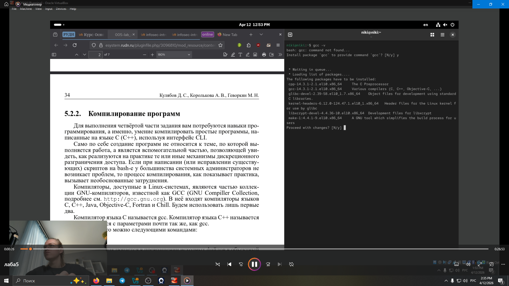
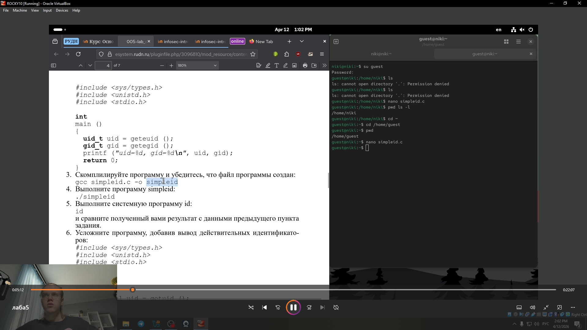
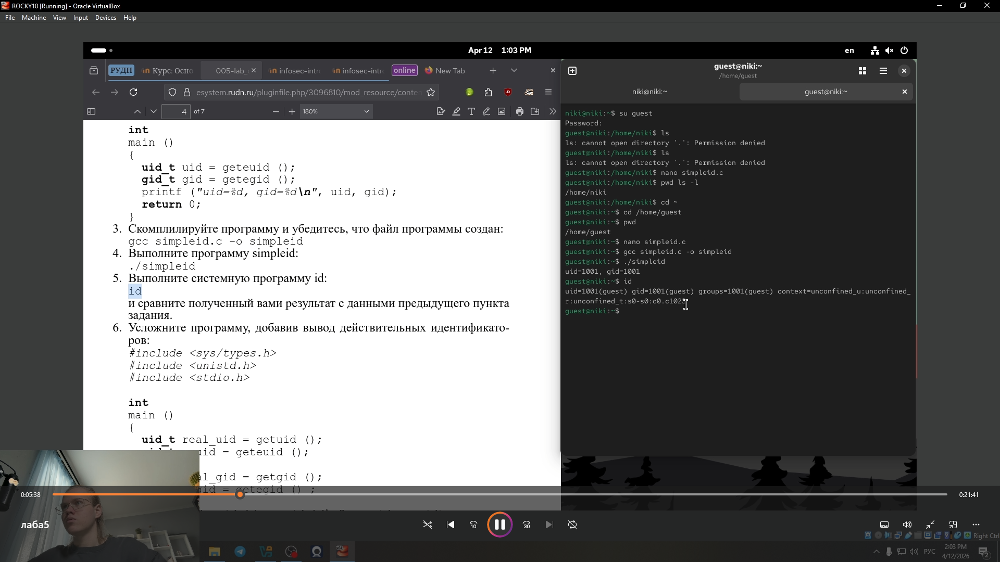
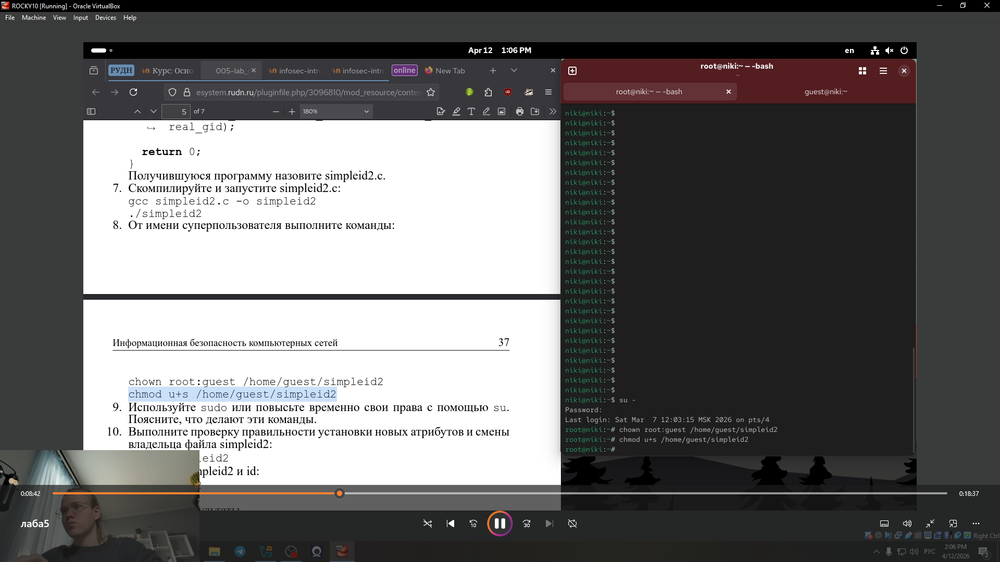
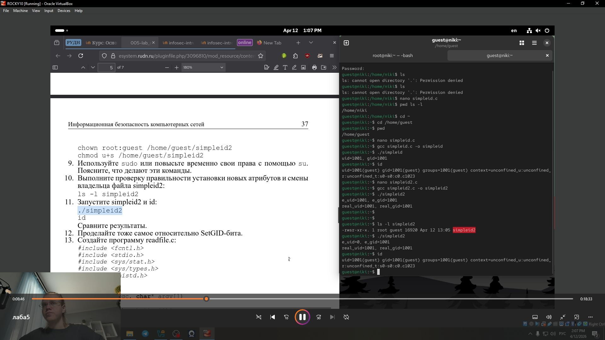
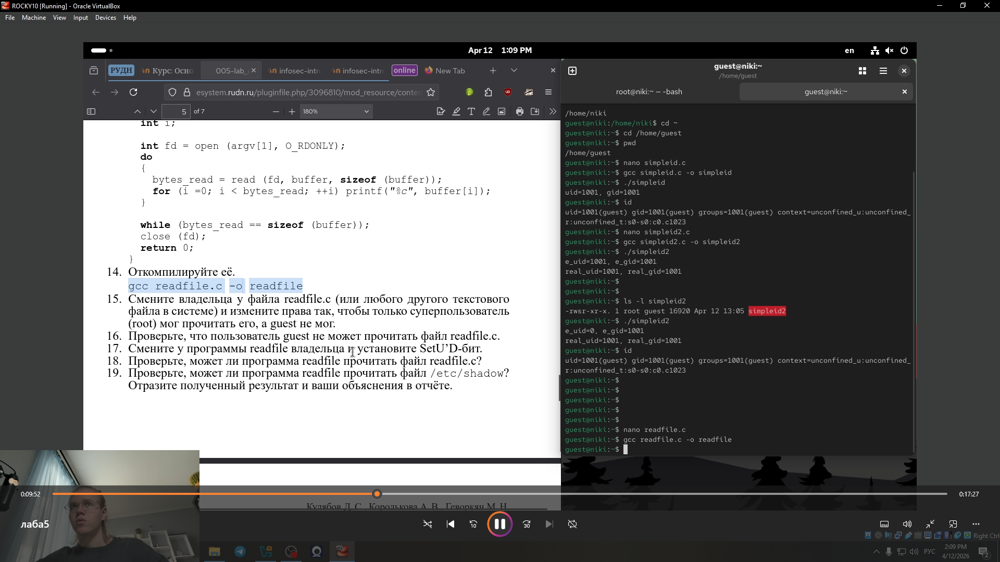
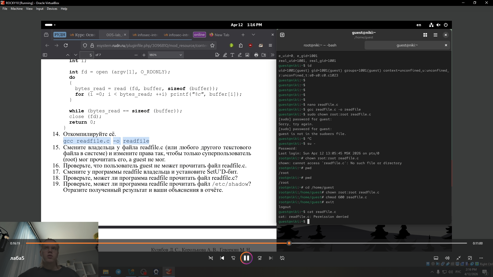
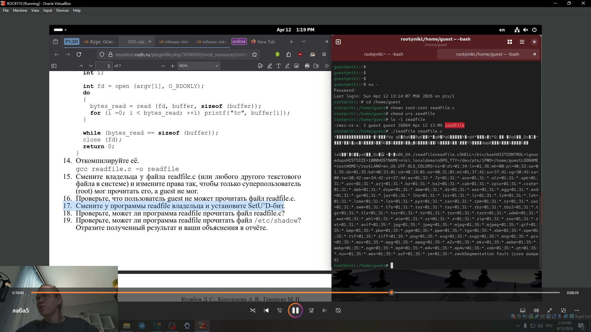
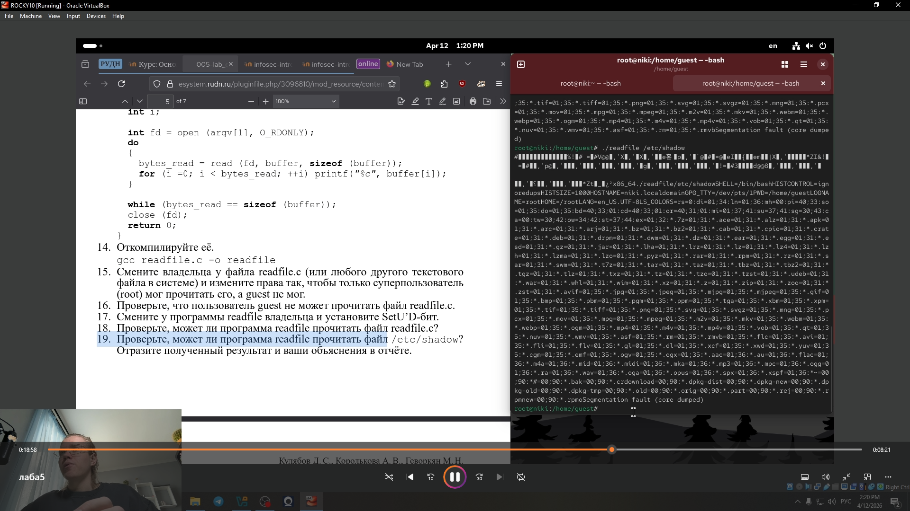
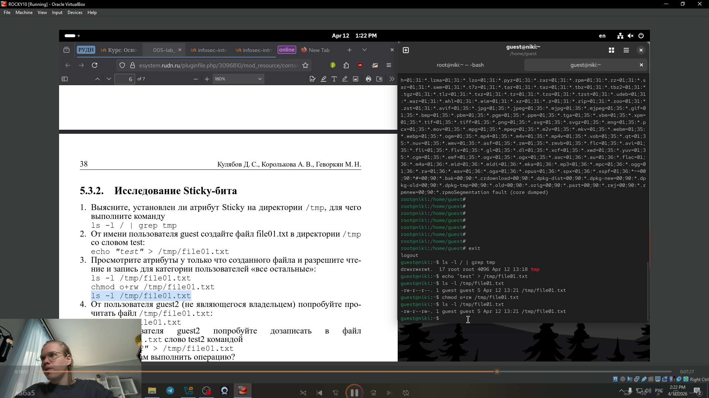

---
## Front matter
lang: ru-RU
title: Лабораторная работа № 5.
subtitle: Дискреционное разграничение прав в Linux. Исследование влияния дополнительных атрибутов
author:
  - Глобин Никита Анатольевич
institute:
  - Российский университет дружбы народов, Москва, Россия

date: 04 04 2026

## i18n babel
babel-lang: russian
babel-otherlangs: english

## Formatting pdf
toc: false
toc-title: Содержание
slide_level: 2
aspectratio: 169
section-titles: true
theme: metropolis
header-includes:
 - \metroset{progressbar=frametitle,sectionpage=progressbar,numbering=fraction}
---

# Информация


# Создание презентации

## Процессор `pandoc`

- Pandoc: преобразователь текстовых файлов
- Сайт: <https://pandoc.org/>
- Репозиторий: <https://github.com/jgm/pandoc>

## Формат `pdf`

- Использование LaTeX
- Пакет для презентации: [beamer](https://ctan.org/pkg/beamer)
- Тема оформления: `metropolis`

## Код для формата `pdf`

```yaml
slide_level: 2
aspectratio: 169
section-titles: true
theme: metropolis
```

## Формат `html`

- Используется фреймворк [reveal.js](https://revealjs.com/)
- Используется [тема](https://revealjs.com/themes/) `beige`

## Код для формата `html`

- Тема задаётся в файле `Makefile`

```make
REVEALJS_THEME = beige 
```

# Элементы презентации


## Цели и задачи

Изучение механизмов изменения идентификаторов, применения
SetUID- и Sticky-битов. Получение практических навыков работы в кон-
соли с дополнительными атрибутами. Рассмотрение работы механизма
смены идентификатора процессов пользователей, а также влияние бита
Sticky на запись и удаление файлов.


## Содержание исследования


устоновка недостающих пакетов(рис. [-@fig:001]).

{#fig:001 width=70%}

## Содержание исследования


проверка пакетов(рис. [-@fig:002]).

{#fig:002 width=70%}


## Содержание исследования


создание файла и компиляция (рис. [-@fig:003]).

{#fig:003 width=70%}


## Содержание исследования


сравнение с id (рис. [-@fig:004]).

{#fig:004 width=70%}


## Содержание исследования


создание файла 2 и компиляция (рис. [-@fig:005]).

{#fig:005 width=70%}

## Содержание исследования


изменение правил и владельца (рис. [-@fig:006]).

{#fig:006 width=70%}


## Содержание исследования


запуск (рис. [-@fig:007]).

{#fig:007 width=70%}


## Содержание исследования


открываем (рис. [-@fig:008]).

{#fig:008 width=70%}


## Содержание исследования


меняем правила (рис. [-@fig:009]).

{#fig:009 width=70%}


## Содержание исследования


скомпилируем (рис. [-@fig:010]).

{#fig:010 width=70%}


## Содержание исследования


setU`D-бит  (рис. [-@fig:011]).

{#fig:011 width=70%}


## Содержание исследования


попытка прочитать этот файл (рис. [-@fig:012]).

{#fig:012 width=70%}


## Содержание исследования


попытка прочитать этот файл (рис. [-@fig:013]).

{#fig:013 width=70%}


## Содержание исследования


работаем с правами (рис. [-@fig:014]).

{#fig:014 width=70%}


## Содержание исследования


работаем с правами (рис. [-@fig:015]).

{#fig:015 width=70%}

## Содержание исследования


работаем с правами (рис. [-@fig:016]).

{#fig:016 width=70%}


## Содержание исследования


работаем с правами (рис. [-@fig:017]).

{#fig:017 width=70%}


## Результаты

- Не нужны все результаты
- Необходимы логические связки между слайдами
- Необходимо показать понимание материала


## Итоговый слайд

Мы научились пользовватся SetUID- и Sticky-битов


