---
## Front matter
lang: ru-RU
title: Лабораторная работа № 6.
subtitle: Мандатное разграничение прав в Linux
author:
  - Глобин Никита Анатольевич
institute:
  - Российский университет дружбы народов, Москва, Россия

date: 04 04 2026

## i18n babel
babel-lang: russian
babel-otherlangs: english

## Formatting pdf
toc: false
toc-title: Содержание
slide_level: 2
aspectratio: 169
section-titles: true
theme: metropolis
header-includes:
 - \metroset{progressbar=frametitle,sectionpage=progressbar,numbering=fraction}
---

# Информация


# Создание презентации

## Процессор `pandoc`

- Pandoc: преобразователь текстовых файлов
- Сайт: <https://pandoc.org/>
- Репозиторий: <https://github.com/jgm/pandoc>

## Формат `pdf`

- Использование LaTeX
- Пакет для презентации: [beamer](https://ctan.org/pkg/beamer)
- Тема оформления: `metropolis`

## Код для формата `pdf`

```yaml
slide_level: 2
aspectratio: 169
section-titles: true
theme: metropolis
```

## Формат `html`

- Используется фреймворк [reveal.js](https://revealjs.com/)
- Используется [тема](https://revealjs.com/themes/) `beige`

## Код для формата `html`

- Тема задаётся в файле `Makefile`

```make
REVEALJS_THEME = beige 
```

# Элементы презентации


## Цели и задачи

- Проверить текущий режим работы SELinux (getenforce, sestatus) и убедиться, что политика targeted активна.

- Определить контекст безопасности (тип) процессов httpd и файлов в /var/www/html с помощью ps auxZ и ls -Z.

- Создать тестовый HTML-файл и изменить его контекст на samba_share_t, чтобы вызвать ошибку доступа (Forbidden) и проанализировать логи /var/log/messages и /var/log/audit/audit.log.

- Изменить порт прослушивания Apache с 80 на 81, устранить возникший сбой, добавив новый порт в политику SELinux через semanage port -a -t http_port_t -p tcp 81.

- Вернуть корректный контекст файлу и штатный порт, удалив временную привязку.


## Содержание исследования


1. Войдите в систему с полученными учётными данными и убедитесь, что
SELinux работает в режиме enforcing политики targeted с помощью ко-
манд getenforce и sestatus .

{ width=70%}


## Содержание исследования


2. Обратитесь с помощью браузера к веб-серверу, запущенному на вашем
компьютере, и убедитесь, что последний работает:
service httpd status.

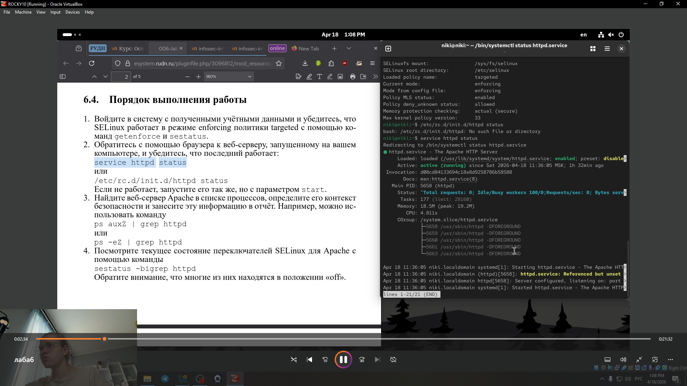{ width=70%}


## Содержание исследования


3. айдите веб-сервер Apache в списке процессов, определите его контекст
безопасности и занесите эту информацию в отчёт. Например, можно ис-
пользовать команду
ps auxZ | grep httpd.

{ width=70%}


## Содержание исследования


4. осмотрите текущее состояние переключателей SELinux для Apache с
помощью команды
sestatus -bigrep httpd

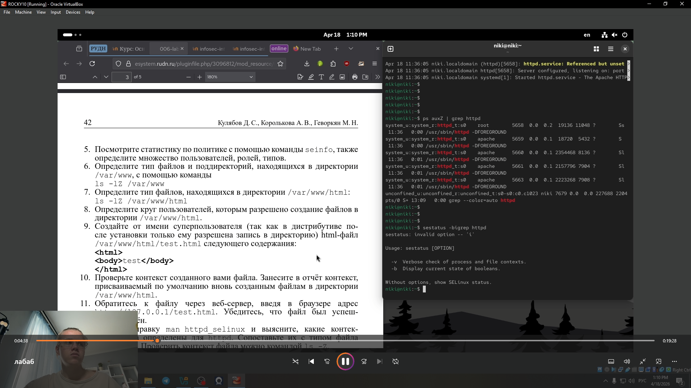{ width=70%}


## Содержание исследования


5. Посмотрите статистику по политике с помощью команды seinfo, также
определите множество пользователей, ролей, типов 

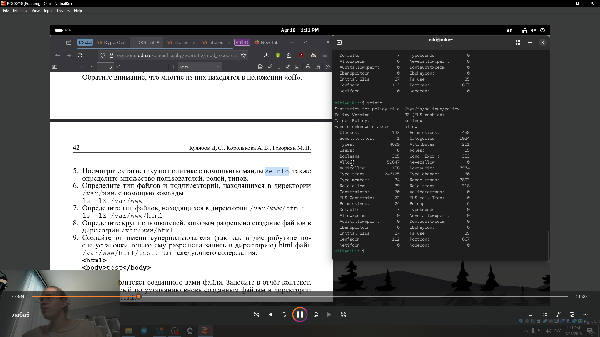{ width=70%}

## Содержание исследования


6. Определите тип файлов и поддиректорий, находящихся в директории
/var/www, с помощью команды
ls -lZ /var/www.

{ width=70%}


## Содержание исследования


7. пределите тип файлов, находящихся в директории /var/www/html: .

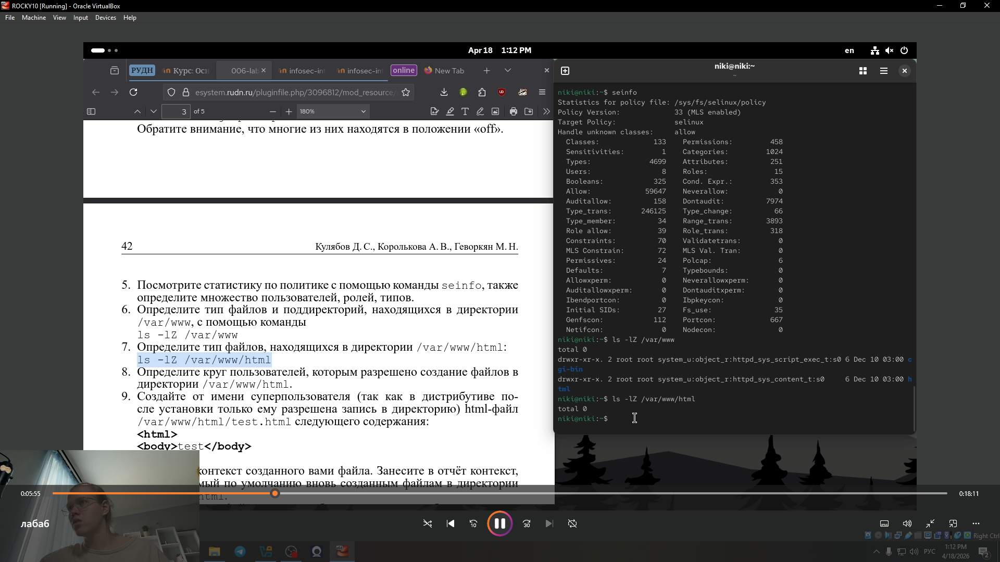{ width=70%}

## Содержание исследования


8. Определите круг пользователей, которым разрешено создание файлов в
директории /var/www/html.
 
 
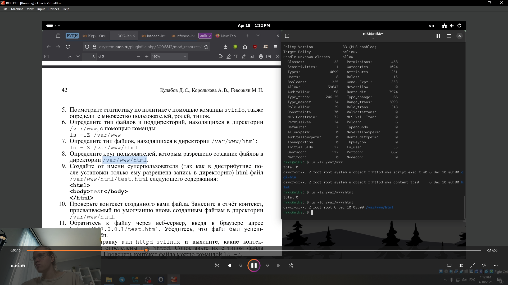{ width=70%}

## Содержание исследования


9. Создайте от имени суперпользователя (так как в дистрибутиве по-
сле установки только ему разрешена запись в директорию) html-файл
/var/www/html/test.html следующего содержания


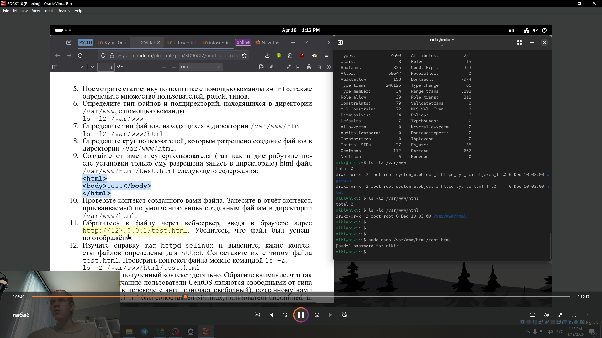{ width=70%}

## Содержание исследования


10. Проверьте контекст созданного вами файла. Занесите в отчёт контекст,
присваиваемый по умолчанию вновь созданным файлам в директории
/var/www/html .

{ width=70%}


## Содержание исследования


11. Обратитесь к файлу через веб-сервер, введя в браузере адрес
http://127.0.0.1/test.html. Убедитесь, что файл был успеш-
но отображён.

{ width=70%}


## Содержание исследования


12. Изучите справку man httpd_selinux

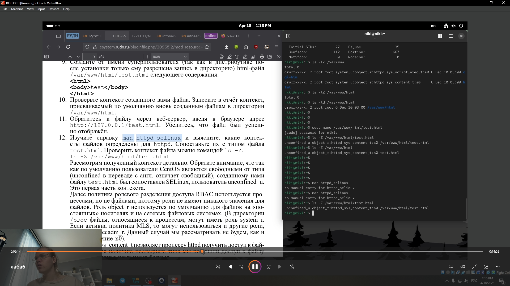{ width=70%}


## Содержание исследования


13. Измените контекст файла /var/www/html/test.html

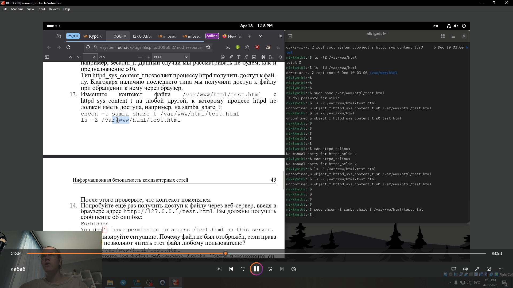{ width=70%}


## Содержание исследования


14. Попробуйте ещё раз получить доступ к файлу через веб-сервер, введя в
браузере адрес http://127.0.0.1/test.htm.

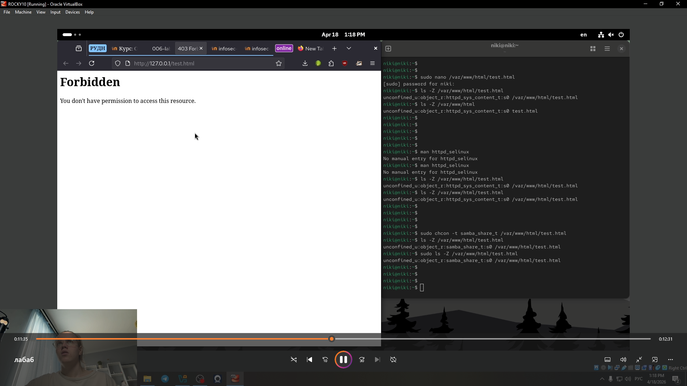{ width=70%}


## Содержание исследования


15. проанализируйте ситуацию. Почему файл не был отображён, если права
доступа позволяют читать этот файл любому пользователю?

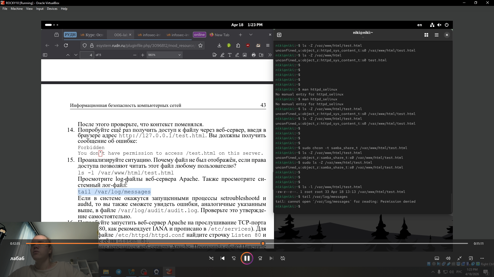{ width=70%}

## Содержание исследования


16. опробуйте запустить веб-сервер Apache на прослушивание ТСР-порта
81 (а не 80, как рекомендует IANA и прописано в /etc/services). Для
этого в файле /etc/httpd/httpd.conf найдите строчку Listen 80 и
замените её на Listen 81

{ width=70%}


## Содержание исследования


17. ыполните перезапуск веб-сервера Apache

{ width=70%}


## Содержание исследования


18. Проанализируйте лог-файлы

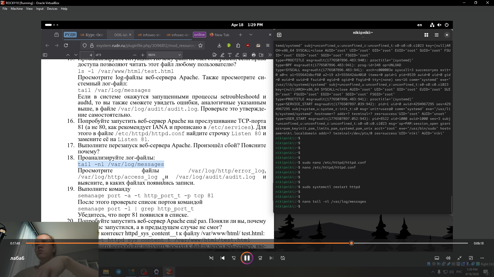{ width=70%}


## Содержание исследования


19. Выполните команду
semanage port -a -t http_port_t -р tcp 81
После этого проверьте список портов командой
semanage port -l | grep http_port_tрис.

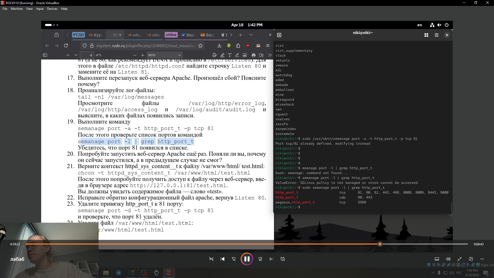{ width=70%}


## Содержание исследования


20. Попробуйте запустить веб-сервер Apache ещё раз. Поняли ли вы, почему
он сейчас запустился, а в предыдущем случае не смог.

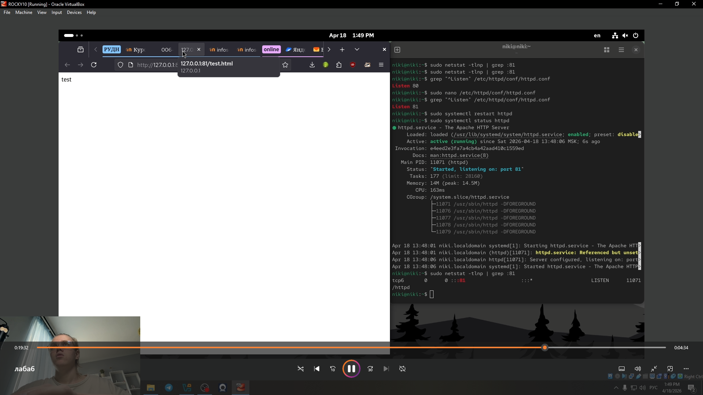{ width=70%}


## Содержание исследования


21. Верните контекст httpd_sys_cоntent__t к файлу /var/www/html/ test.html:
chcon -t httpd_sys_content_t /var/www/html/test.html
После этого попробуйте получить доступ к файлу через веб-сервер, вве-
дя в браузере адрес http://127.0.0.1:81/test.html.
Вы должны увидеть содержимое файла — слово «test»..

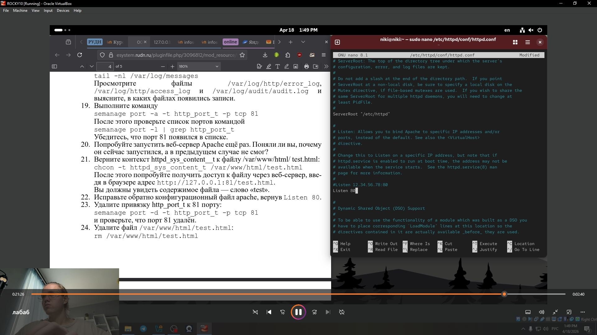{ width=70%}


## Содержание исследования


22. Исправьте обратно конфигурационный файл apache, вернув Listen 80..

{ width=70%}


## Содержание исследования


23. далите файл 

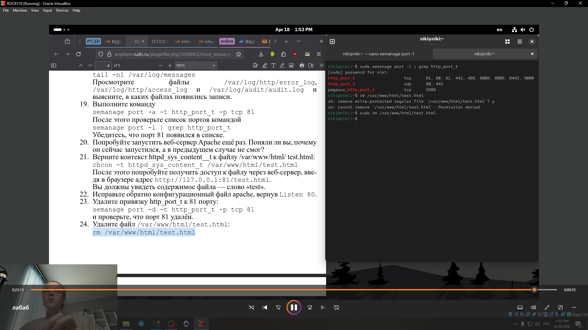{ width=70%}


## Результаты


Мы научились анализировать и изменять контексты безопасности SELinux для файлов и процессов, а также управлять сетевыми портами веб-сервера Apache в режиме enforcing политики targeted. На практике мы освоили, как мандатное разграничение доступа (MAC) поверх дискреционного (DAC) блокирует или разрешает работу сервера даже при наличии стандартных прав на чтение/запись.


