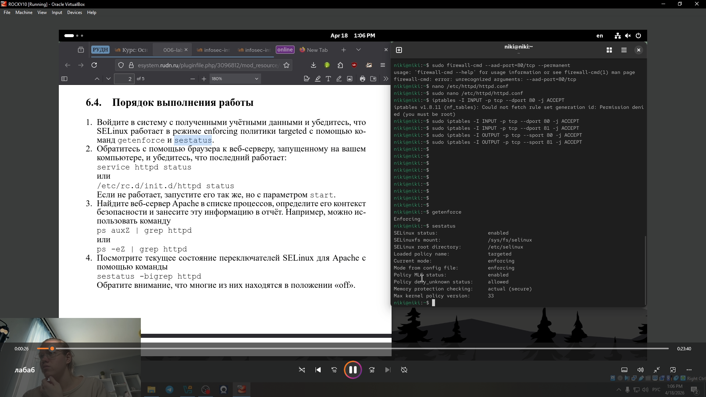
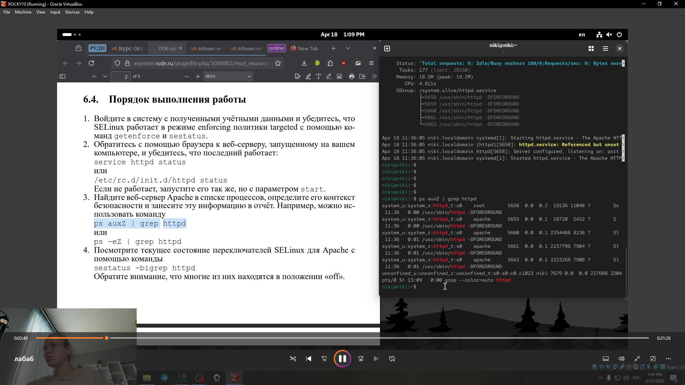
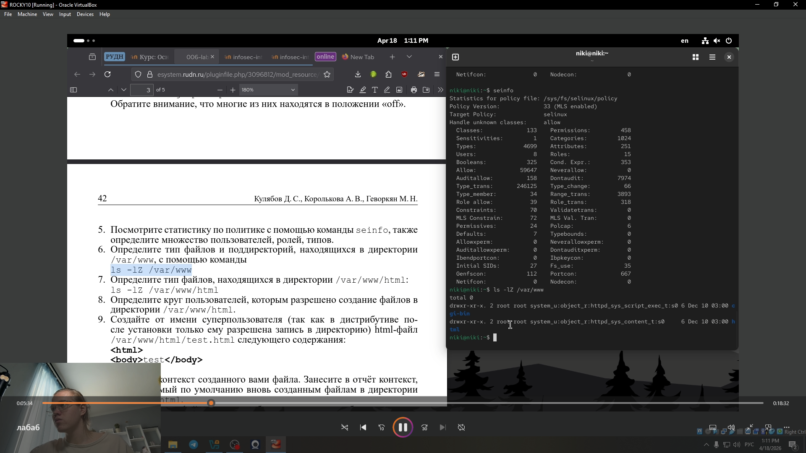
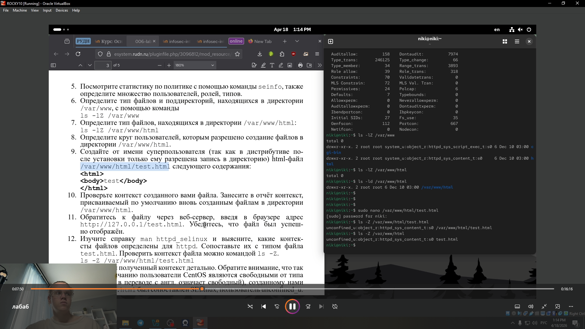
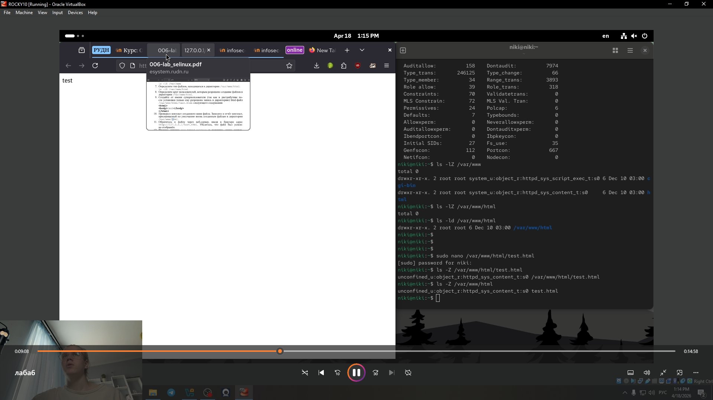
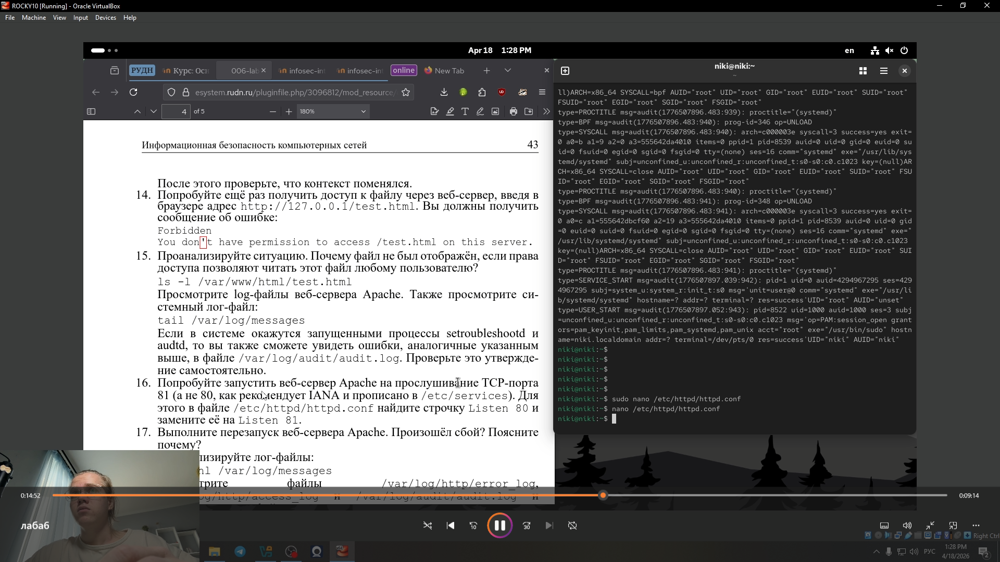
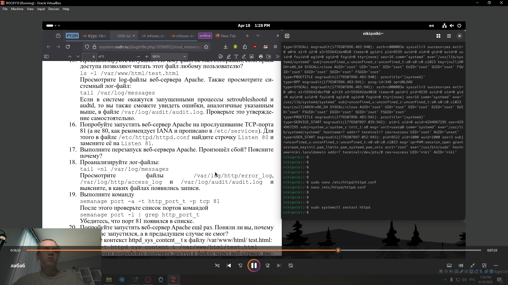
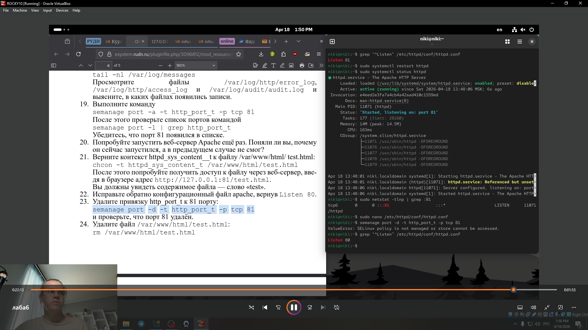

---
## Front matter
title: "Лабораторная работа № 6."
subtitle: "Мандатное разграничение прав в Linux"
author: "Глобин Никита Анатольевич"

## Generic otions
lang: ru-RU
toc-title: "Содержание"

## Bibliography
bibliography: bib/cite.bib
csl: pandoc/csl/gost-r-7-0-5-2008-numeric.csl

## Pdf output format
toc: true # Table of contents
toc-depth: 2
lof: true # List of figures
lot: true # List of tables
fontsize: 12pt
linestretch: 1.5
papersize: a4
documentclass: scrreprt
## I18n polyglossia
polyglossia-lang:
  name: russian
  options:
	- spelling=modern
	- babelshorthands=true
polyglossia-otherlangs:
  name: english
## I18n babel
babel-lang: russian
babel-otherlangs: english
## Fonts
mainfont: IBM Plex Serif
romanfont: IBM Plex Serif
sansfont: IBM Plex Sans
monofont: IBM Plex Mono
mathfont: STIX Two Math
mainfontoptions: Ligatures=Common,Ligatures=TeX,Scale=0.94
romanfontoptions: Ligatures=Common,Ligatures=TeX,Scale=0.94
sansfontoptions: Ligatures=Common,Ligatures=TeX,Scale=MatchLowercase,Scale=0.94
monofontoptions: Scale=MatchLowercase,Scale=0.94,FakeStretch=0.9
mathfontoptions:
## Biblatex
biblatex: true
biblio-style: "gost-numeric"
biblatexoptions:
  - parentracker=true
  - backend=biber
  - hyperref=auto
  - language=auto
  - autolang=other*
  - citestyle=gost-numeric
## Pandoc-crossref LaTeX customization
figureTitle: "Рис."
tableTitle: "Таблица"
listingTitle: "Листинг"
lofTitle: "Список иллюстраций"
lotTitle: "Список таблиц"
lolTitle: "Листинги"
## Misc options
indent: true
header-includes:
  - \usepackage{indentfirst}
  - \usepackage{float} # keep figures where there are in the text
  - \floatplacement{figure}{H} # keep figures where there are in the text
---

# Цель работы

Развить навыки администрирования ОС Linux. Получить первое прак-
тическое знакомство с технологией SELinux1.
Проверить работу SELinx на практике совместно с веб-сервером
Apache.

# Задание

- Проверить текущий режим работы SELinux (getenforce, sestatus) и убедиться, что политика targeted активна.

- Определить контекст безопасности (тип) процессов httpd и файлов в /var/www/html с помощью ps auxZ и ls -Z.

- Создать тестовый HTML-файл и изменить его контекст на samba_share_t, чтобы вызвать ошибку доступа (Forbidden) и проанализировать логи /var/log/messages и /var/log/audit/audit.log.

- Изменить порт прослушивания Apache с 80 на 81, устранить возникший сбой, добавив новый порт в политику SELinux через semanage port -a -t http_port_t -p tcp 81.

- Вернуть корректный контекст файлу и штатный порт, удалив временную привязку.

# Выполнение лабораторной работы

1. Войдите в систему с полученными учётными данными и убедитесь, что
SELinux работает в режиме enforcing политики targeted с помощью ко-
манд getenforce и sestatus (рис. [-@fig:001]).

{#fig:001 width=70%}

2. Обратитесь с помощью браузера к веб-серверу, запущенному на вашем
компьютере, и убедитесь, что последний работает:
service httpd status(рис. [-@fig:002]).

{#fig:002 width=70%}

3. айдите веб-сервер Apache в списке процессов, определите его контекст
безопасности и занесите эту информацию в отчёт. Например, можно ис-
пользовать команду
ps auxZ | grep httpd(рис. [-@fig:003]).

{#fig:003 width=70%}

4. осмотрите текущее состояние переключателей SELinux для Apache с
помощью команды
sestatus -bigrep httpd(рис. [-@fig:004]).

{#fig:004 width=70%}

5. Посмотрите статистику по политике с помощью команды seinfo, также
определите множество пользователей, ролей, типов (рис. [-@fig:005]).

{#fig:005 width=70%}

6. Определите тип файлов и поддиректорий, находящихся в директории
/var/www, с помощью команды
ls -lZ /var/www(рис. [-@fig:006]).

{#fig:006 width=70%}

7. пределите тип файлов, находящихся в директории /var/www/html: (рис. [-@fig:007]).

{#fig:007 width=70%}

8. Определите круг пользователей, которым разрешено создание файлов в
директории /var/www/html.
 (рис. [-@fig:008]).

{#fig:008 width=70%}

9. Создайте от имени суперпользователя (так как в дистрибутиве по-
сле установки только ему разрешена запись в директорию) html-файл
/var/www/html/test.html следующего содержания:
<html>
<body>test</body>
</html>(рис. [-@fig:009]).

{#fig:009 width=70%}

10. Проверьте контекст созданного вами файла. Занесите в отчёт контекст,
присваиваемый по умолчанию вновь созданным файлам в директории
/var/www/html (рис. [-@fig:010]).

{#fig:010 width=70%}

11. Обратитесь к файлу через веб-сервер, введя в браузере адрес
http://127.0.0.1/test.html. Убедитесь, что файл был успеш-
но отображён(рис. [-@fig:011]).

{#fig:011 width=70%}

12. Изучите справку man httpd_selinux(рис. [-@fig:012]).

{#fig:012 width=70%}

13. Измените контекст файла /var/www/html/test.html (рис. [-@fig:013]).

{#fig:013 width=70%}

14. Попробуйте ещё раз получить доступ к файлу через веб-сервер, введя в
браузере адрес http://127.0.0.1/test.htm(рис. [-@fig:014]).

{#fig:014 width=70%}

15. проанализируйте ситуацию. Почему файл не был отображён, если права
доступа позволяют читать этот файл любому пользователю?(рис. [-@fig:015]).

{#fig:015 width=70%}

16. опробуйте запустить веб-сервер Apache на прослушивание ТСР-порта
81 (а не 80, как рекомендует IANA и прописано в /etc/services). Для
этого в файле /etc/httpd/httpd.conf найдите строчку Listen 80 и
замените её на Listen 81.(рис. [-@fig:016]).

{#fig:016 width=70%}

17. ыполните перезапуск веб-сервера Apache. (рис. [-@fig:017]).

{#fig:017 width=70%}

18. Проанализируйте лог-файлы: (рис. [-@fig:018]).

{#fig:018 width=70%}

19. Выполните команду
semanage port -a -t http_port_t -р tcp 81
После этого проверьте список портов командой
semanage port -l | grep http_port_tрис. (рис. [-@fig:019]).

{#fig:019 width=70%}

20. Попробуйте запустить веб-сервер Apache ещё раз. Поняли ли вы, почему
он сейчас запустился, а в предыдущем случае не смог(рис. [-@fig:020]).

{#fig:020 width=70%}

21. Верните контекст httpd_sys_cоntent__t к файлу /var/www/html/ test.html:
chcon -t httpd_sys_content_t /var/www/html/test.html
После этого попробуйте получить доступ к файлу через веб-сервер, вве-
дя в браузере адрес http://127.0.0.1:81/test.html.
Вы должны увидеть содержимое файла — слово «test».(рис. [-@fig:021]).

{#fig:021 width=70%}

22. Исправьте обратно конфигурационный файл apache, вернув Listen 80.(рис. [-@fig:022]).

{#fig:022 width=70%}

23. далите файл (рис. [-@fig:023]).

{#fig:023 width=70%}

# Выводы

Мы научились анализировать и изменять контексты безопасности SELinux для файлов и процессов, а также управлять сетевыми портами веб-сервера Apache в режиме enforcing политики targeted. На практике мы освоили, как мандатное разграничение доступа (MAC) поверх дискреционного (DAC) блокирует или разрешает работу сервера даже при наличии стандартных прав на чтение/запись.

