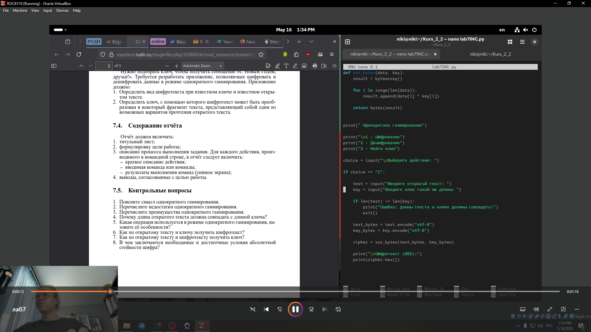
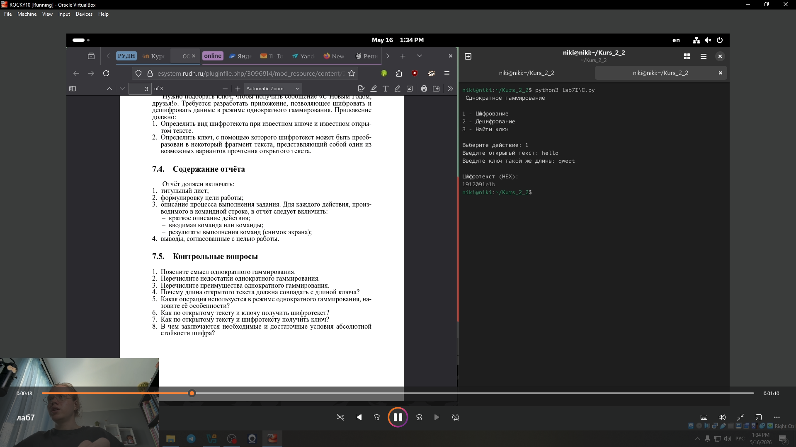
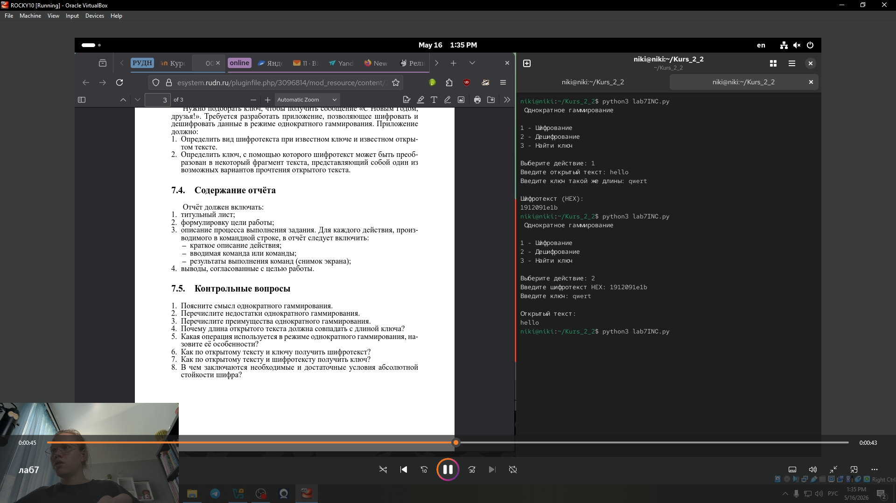
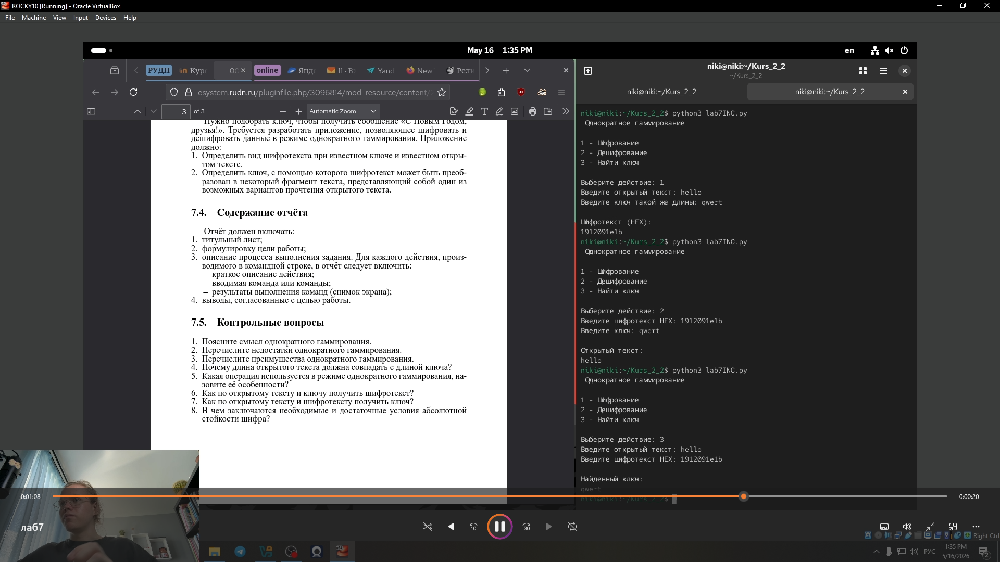

---
## Front matter
lang: ru-RU
title: Лабораторная работа № 7
subtitle: Элементы криптографии. Однократное гаммирование
author:
  - Глобин Никита Анатольевич
institute:
  - Российский университет дружбы народов, Москва, Россия
  - Объединённый институт ядерных исследований, Дубна, Россия
date: 16 05 2026

## i18n babel
babel-lang: russian
babel-otherlangs: english

## Formatting pdf
toc: false
toc-title: Содержание
slide_level: 2
aspectratio: 169
section-titles: true
theme: metropolis
header-includes:
 - \metroset{progressbar=frametitle,sectionpage=progressbar,numbering=fraction}
---

# Информация

## Докладчик

  * Глобин Никита Анатольевич
  * Российский университет дружбы народов

# Элементы презентации

## Цели и задачи

получить проктические навыки Элементы криптографии. Однократное гаммирование

## Содержание исследования

мой код для для реализации Однократное гаммирование

{width=70%}

## Содержание исследования

пример шифрования .

{width=70%}

## Содержание исследования

пример расшифрования 

{width=70%}

## Содержание исследования

пример нахождения ключа.

{width=70%}

## Результаты

Мы получили практически навыки по работе с Элементы криптографии. Однократное гаммирование

