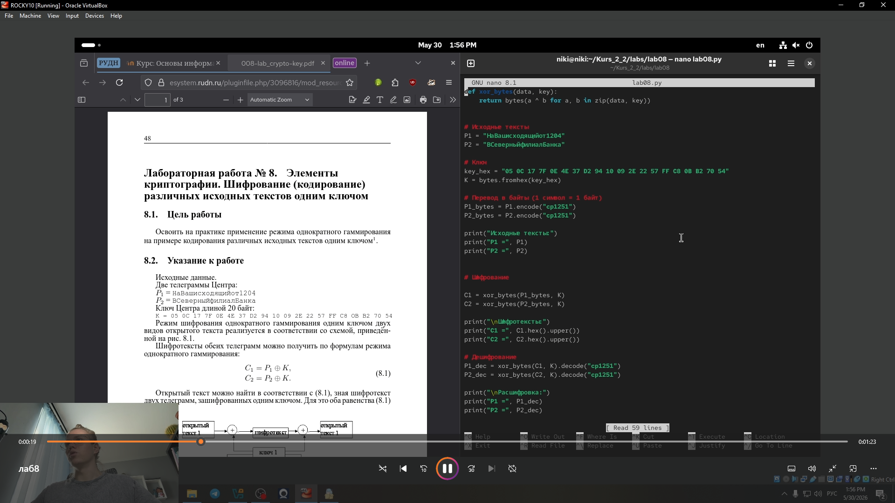
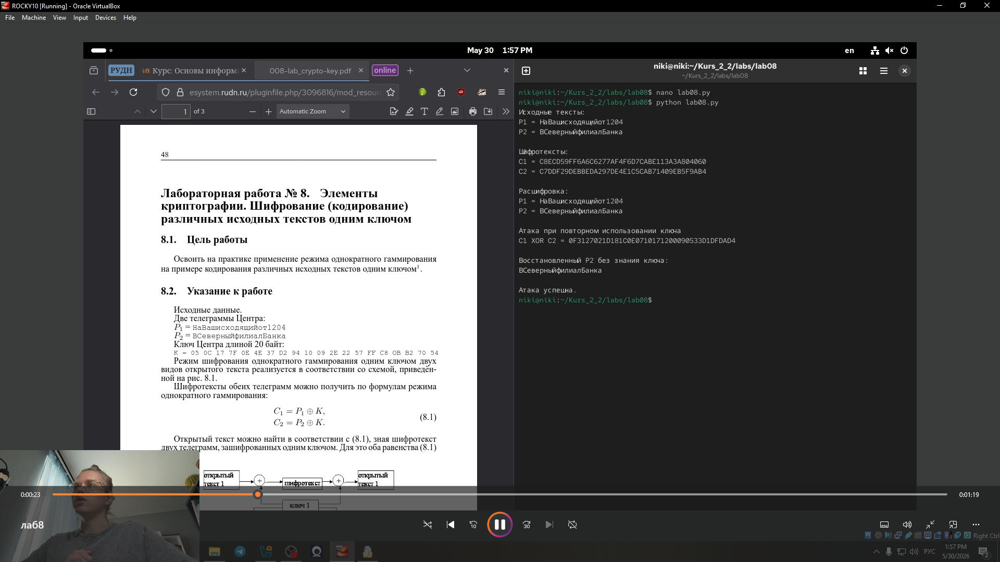

---
## Front matter
lang: ru-RU
title: Лабораторная работа № 8
subtitle: Элементы криптографии. Шифрование (кодирование) различных исходных текстов одним ключом
author:
  - Глобин Никита Анатольевич
institute:
  - Российский университет дружбы народов, Москва, Россия

date: 30 05 2026

## i18n babel
babel-lang: russian
babel-otherlangs: english

## Formatting pdf
toc: false
toc-title: Содержание
slide_level: 2
aspectratio: 169
section-titles: true
theme: metropolis
header-includes:
 - \metroset{progressbar=frametitle,sectionpage=progressbar,numbering=fraction}
---

# Информация

## Докладчик

  * Глобин Никита Анатольевич

  * Российский университет дружбы народов

# Элементы презентации

## Цели и задачи

- Освоить на практике применение режима однократного гаммирования на примере кодирования различных исходных текстов одним ключом

## Материалы и методы

- Представляйте данные качественно
- Количественно, только если крайне необходимо
- Излишние детали не нужны

## Содержание исследования

код (рис. [-@fig:001]).

{#fig:001 width=70%}

## Содержание исследования

вывод результатов (рис. [-@fig:002]).

{#fig:002 width=70%}

## Результаты

Мы написали код для реализации Шифрование различных исходных текстов одним ключом

