---
## Front matter
lang: ru-RU
title: Внешний курс
subtitle: часть 3
author:
  - Глобин Н.А.
institute:
  - Российский университет дружбы народов, Москва, Россия

date: 10 05 2026

## i18n babel
babel-lang: russian
babel-otherlangs: english

## Formatting pdf
toc: false
toc-title: Содержание
slide_level: 2
aspectratio: 169
section-titles: true
theme: metropolis
header-includes:
 - \metroset{progressbar=frametitle,sectionpage=progressbar,numbering=fraction}
---

# Элементы презентации

## Цели и задачи

Пройт внешнийкурс

## Содержание исследования

1. вопрос 1 из (рис. [-@fig:001]).

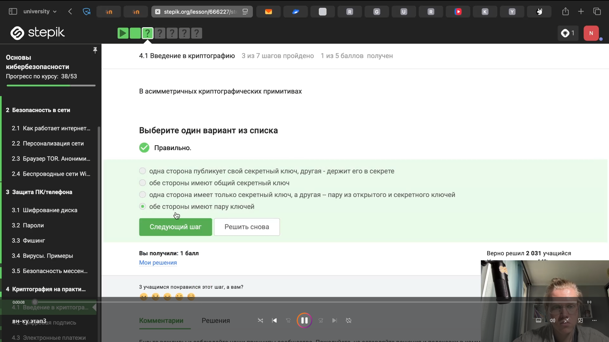{#fig:001 width=70%}

## Содержание исследования

2. вопрос 2 из (рис. [-@fig:002]).

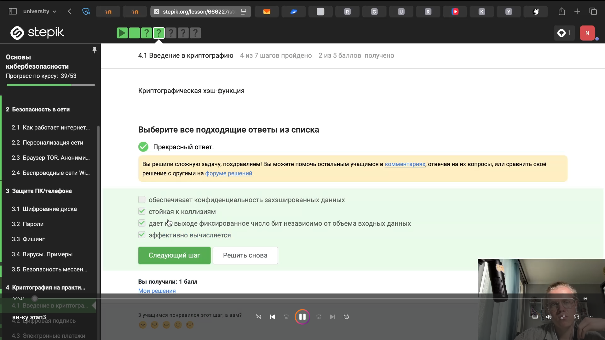{#fig:002 width=70%}

## Содержание исследования

3. вопрос 3 из (рис. [-@fig:003]).

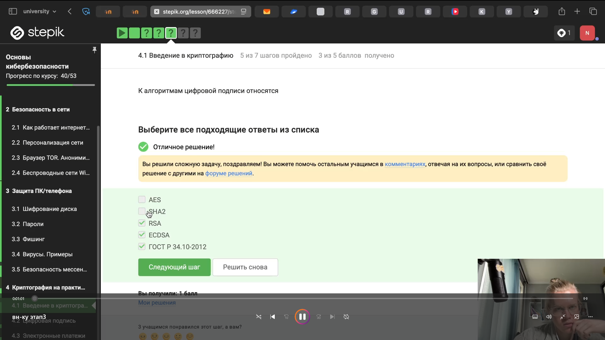{#fig:003 width=70%}

## Содержание исследования

4. вопрос 4 из (рис. [-@fig:004]).

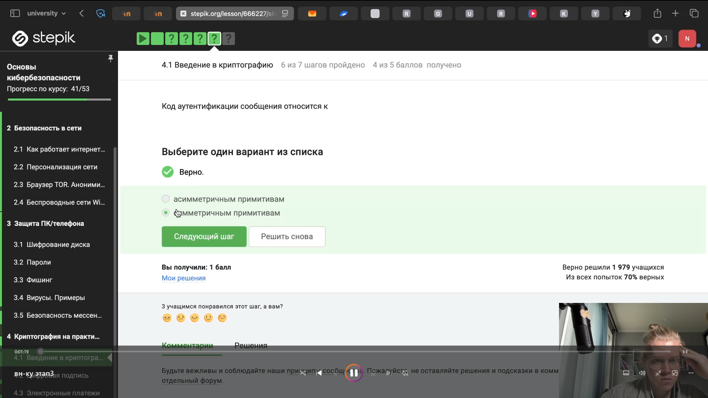{#fig:004 width=70%}

## Содержание исследования

5. вопрос 5 из (рис. [-@fig:005]).

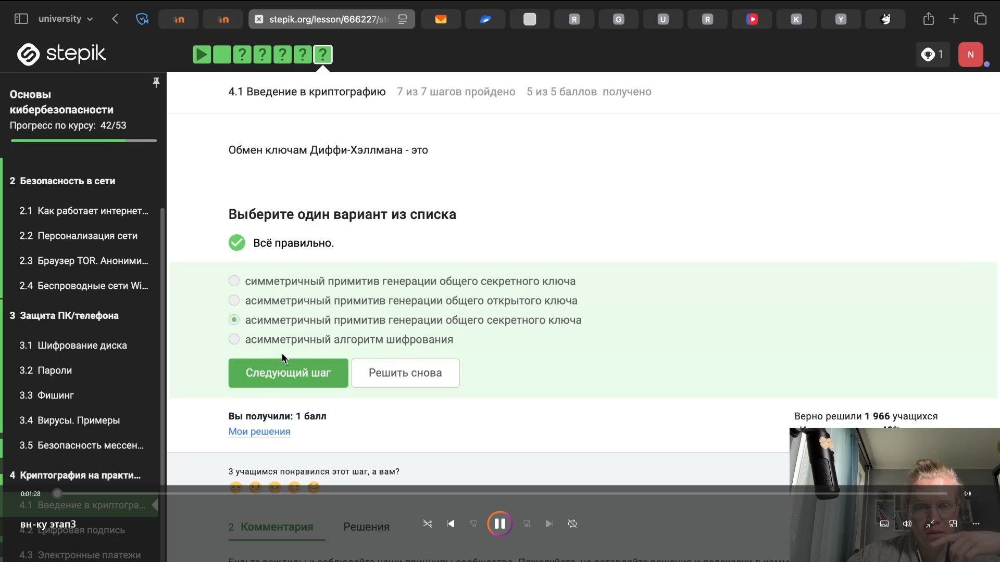{#fig:005 width=70%}

## Содержание исследования

6. вопрос 6 из (рис. [-@fig:006]).

{#fig:006 width=70%}

## Содержание исследования

7. вопрос 7 из (рис. [-@fig:007]).

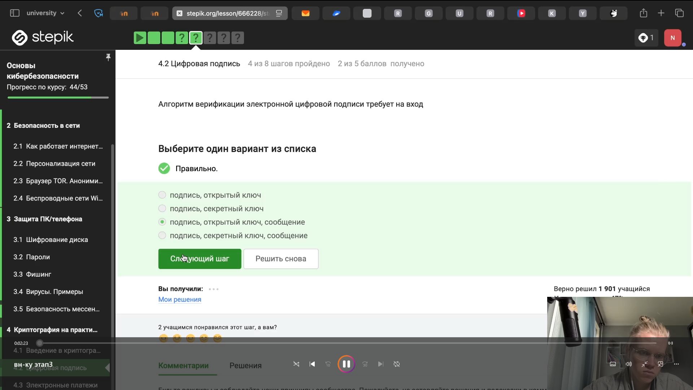{#fig:007 width=70%}

## Содержание исследования

8. вопрос 8 из (рис. [-@fig:008]).

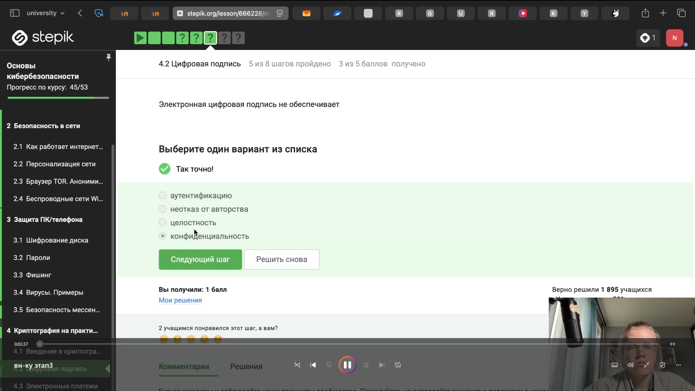{#fig:008 width=70%}

## Содержание исследования

9. вопрос 9 из (рис. [-@fig:009]).

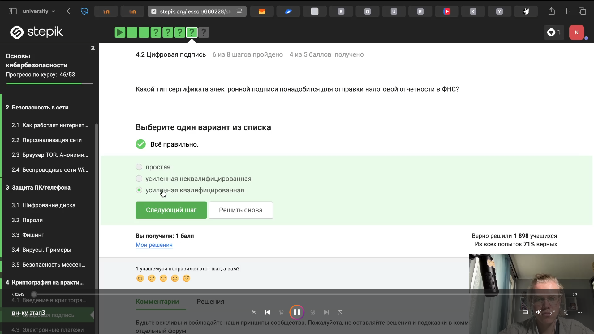{#fig:009 width=70%}

## Содержание исследования

10. вопрос 10 из (рис. [-@fig:010]).

{#fig:010 width=70%}

## Содержание исследования

11. вопрос 11 из (рис. [-@fig:011]).

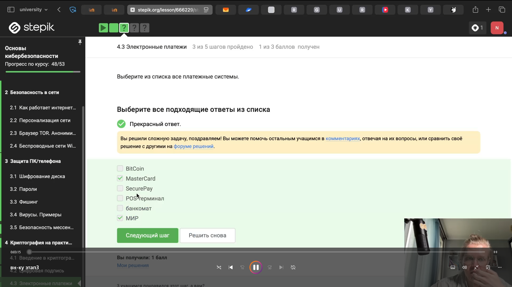{#fig:011 width=70%}

## Содержание исследования

12. вопрос 12 из (рис. [-@fig:012]).

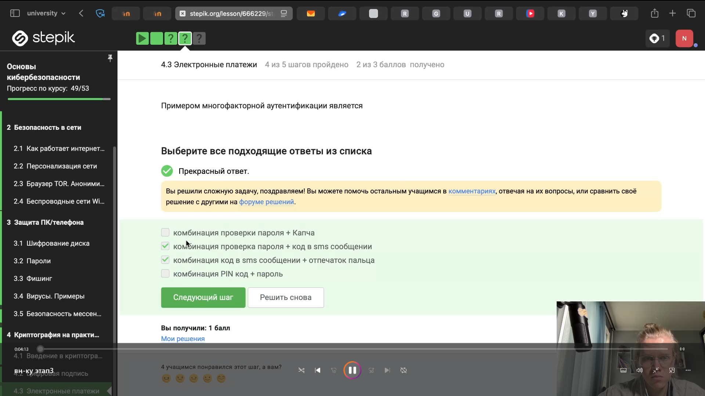{#fig:012 width=70%}

## Содержание исследования

13. вопрос 13 из (рис. [-@fig:013]).

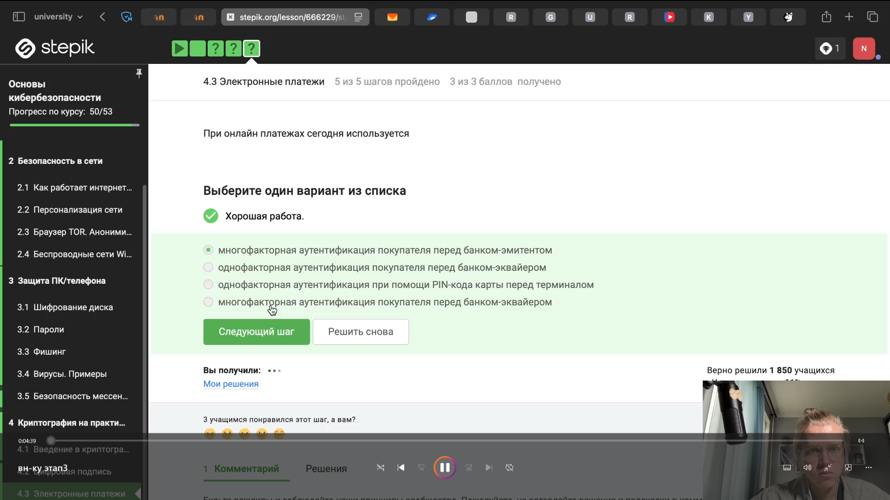{#fig:013 width=70%}

## Содержание исследования

сертификат (рис. [-@fig:014]).

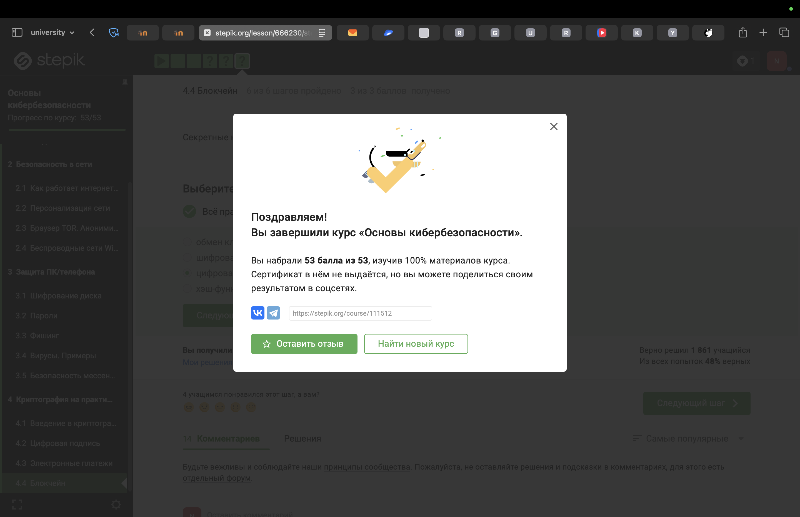{#fig:014 width=70%}

## Результаты

Прошли третью часть курса. И весь курс.

